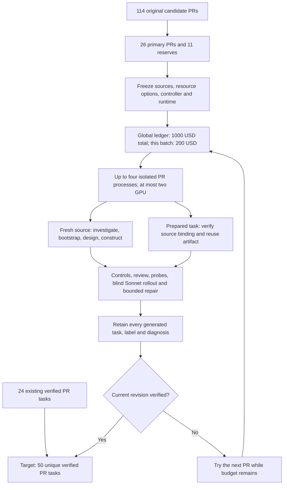

# Tasksmith: retain outputs and expand to 50 verified PR tasks

The September 13 expansion starts with **24 verified PR tasks** and targets **50**
from the original 114-PR list. A frozen panel contains 26 primary candidates and
11 reserves. The v4 continuation runs four independent PR controllers,
with at most two GPU controllers, and starts from **27 independently accepted tasks**.
The panel includes small CPU workloads and real GPU execution. Acceptance requires
the shared quality profile for the exact revision and inspection of its verifier
and rollout evidence. Solver failure can be legitimate and does not by itself
reject a task.

## Retain every generated environment

The initial historical catalog contains 319 Harbor task copies: 291 reproduction
outputs from 14 recipes and 28 Tasksmith PR outputs. Its second diagnosis snapshot
records 24 verified tasks, 29 tasks needing repair, 265 unverified tasks and one
blocked task. Unverified does not mean bad:
historical controls and assistant ratings remain available, but do not establish
the complete quality profile for those exact originals.

Every copy carries the same `metadata.repo2env.evaluation` table in `task.toml`.
The original configurations, tasks and trial records remain unchanged. The
catalog also references 134 previous Tasksmith revisions, including a stale
intermediate task with an integrity failure; that revision is not accepted.

The current local catalog lives at `workspace/tasksmith-scale50/catalog-v2/`. Its
`SUMMARY.md`, `summary.json` and `index.json` provide counts and task paths.
These copies reference original evidence; they are not a portable replacement
for the complete archived task-and-evidence deliveries. The first catalog remains
unchanged. [Public counts by recipe](evidence/tasksmith-catalog-319.json) contain
no private paths or traces.

The four unfinished Tasksmith outputs now have specific current-revision
diagnoses: TRL #6116 fails its reference control; TRL #6001 tests pooling through
test-side simulation; Diffusers #13921 has a verifier timeout, interrupted oracle
and cache configuration mismatch; Accelerate #3720 has a prepared interpreter
fix awaiting fresh GPU validation. Diagnosis manifests bind the inspected files
and distinguish current findings from earlier revision history.

## First expansion findings

The first three attempts cost **$12.12** in accounted model usage and conservative
compute estimates. All three workers were confirmed terminated and their
reservations reconciled. Two Harbor tasks were generated; one attempt stopped
before bootstrap. These are additional to the historical 319-task catalog.

| PR | Observed result | Disposition |
| --- | --- | --- |
| PEFT #2661 | Reference passes; a repaired alternative passes nine tests and fails an internal boolean assertion. The final correction has an invalid traceback citation. | Retain for review of observable cache behavior versus implementation-specific grading. |
| Accelerate #3529 | The automated profile passes, including both generic probes and a reviewed unsuccessful Sonnet rollout. Its thirteen tests never execute the compiled model. | Exclude this revision from the target until actual execution coverage is verified. |
| Diffusers #13168 | Investigation exhausts fourteen calls with an incomplete source-root profile. | Retain the investigation and retry with complete source coverage; no Harbor task exists yet. |

The accepted target count therefore remains **24**, despite one new automated
profile pass. Raw results are preserved. Separate diagnosis copies under
`workspace/tasksmith-scale50/pilot-diagnoses-v1/` label both generated tasks
`needs_repair`; their manifests distinguish measured outcomes from static
counterexamples that have not yet been executed.

The next runtime incorporates the observed failures into shared behavior:

- Explicit `compiled_execution` requirements demand a wrong-solution probe that
  preserves wrappers but breaks runtime behavior. Requirements live in hashed
  task metadata; adding them creates a new revision and requires fresh evidence.
- Review distinguishes internal-state assertions from the public behavior that
  valid alternative implementations must preserve.
- Probe-only repairs reuse unchanged successful probes after validating their
  complete saved evidence. Failed or changed probes still run again.
- Citation corrections identify the exact failing path and quote within the
  existing bounded correction attempt. Source-profile errors list every omitted
  file and the field that needs correction.
- Explicit Hub aliases preserve offline lookup names while reusing the canonical
  asset download layer. GPU quality releases and reconciles its idle author
  worker before allocating native trial resources.

The first batch's admission controller was drained before further dispatch.
Its remaining **$187.88342** expansion allowance carries forward; a continuation
must not reset the original $200 ceiling.

`batch-v2` is the continuation. Its first two candidates reuse the retained PEFT
and Accelerate tasks with fresh review and execution. Accelerate receives the
explicit `compiled_execution` requirement on a new, hashed task copy. Diffusers
receives complete-source feedback and eighteen bounded author calls. The other
candidate PRs and two-worker concurrency remain unchanged.

The repaired Accelerate task subsequently passed its baseline/reference controls,
the same broken-forward probe, a distinct valid alternative and a judged blind
Sonnet rollout. The broken-forward probe changed from reward 1 on the defective
verifier to reward 0 on the repaired verifier, specifically at the numerical
output assertion. Sonnet passed nine of fourteen tests and failed through genuine
implementation errors. Independent evidence review accepted this helper/API task,
bringing the accepted total to **25**; this does not claim complete
Accelerator/DeepSpeed integration or performance reproduction.

For faster expansion, the frozen v3 continuation uses four total PR controllers
with at most two GPU controllers. The shared budget still covers all previous
attempts. Sonnet remains the default; one metered Opus 4.6 escalation can resolve
a review after its bounded Sonnet calls are exhausted. Literal evidence checks
remain required. Improved feedback identifies quotes absent from every supplied
document, and review guidance separates advisory labels from actual task evidence.
Both remaining v2 jobs finished and their workers were reconciled before the
concurrency change. Design retries can revise the previous draft directly; the
seed remains unvalidated and every submission must pass normal validation.
Review corrections and escalation receive the latest parsed draft, including
after additional source reads.

Accelerate #3098 was also independently accepted, bringing the total to **26**.
Its reference passed 23 tests with one hardware skip; Sonnet passed 22 and failed
one because it retained a function that the instruction explicitly required
removing. The wrong-behavior and valid-alternative probes both behaved as
expected. Diffusers #13168 stopped at 26 passing tests and one invalid fixture;
its next design receives the concrete component-loading correction.

V3 starts with **$176.13069** after the first two phases accounted for $23.86931
and released all their reservations. It has 35 pending PRs and initially admits
four prepared-task recoveries: PEFT #2661, Diffusers #13921, TRL #6001 and
Accelerate #3720. Every retained task receives fresh quality checks.

## V4: fresh PRs and bounded recovery

V3 finished eleven attempts and accounted for **$33.659913**, with no remaining
phase reservations. PEFT #3083 passed independent inspection, bringing acceptance
to **27**. PEFT #2939 passed its automated profile but remains excluded: its
instruction promises the smallest rank meeting an energy threshold, while the
tests check patterns and reconstruction error without independently asserting
the cutoff. A constant-rank escape is an unexecuted hypothesis, not a measured
reward hack. The original result and a separate `needs_repair` copy are retained.

V4 contains **24 fresh PRs and ten recoveries**. The first three fresh PRs run
alongside Diffusers #13168 using its exact previously successful bootstrap
profile. Further fresh PRs precede the remaining recoveries. A prepared profile
binds the PR URL, commits, source diff, resource requirement and complete recipe;
it skips profile rediscovery but still requires fresh remote bootstrap. It does
not import an earlier readiness result.

The runtime incorporates concrete review and repair failures:

- Selected private test assertions precede large reference patches and generic
  helpers in the evidence pack. Review must trace central requirements to those
  assertions and use exact inventory paths for additional reads.
- Overlapping search windows merge within the remaining context allowance.
  Existing cited evidence stays unchanged and omitted windows are explicit.
- The existing repair correction receives the rejected proposal, permitted probe
  changes and remaining calls. Invalid wrong-solution probes remain unresolved;
  the verifier must not be weakened merely to reject a no-op probe.
- Diffusers #13921 has a preserved assisted wrapper revision: the outer timeout
  exceeds the inner timeout and the grader receives image-defined offline cache
  variables. All selectors and scored test IDs remain unchanged. This revision
  still needs fresh execution evidence.

V1–v3 together accounted for **$57.529223**, leaving **$142.470777** for v4 under
the same cumulative $200 ceiling. Historical unresolved holds remain separate
and intact. The final runtime passed **1,226 local tests**, with six skipped
(two optional-dependency suites and four opt-in integration checks).

## Execution and budget



The overall authorization is **$1,000**, including historical costs. The next
batch has its own **$200 ceiling**, covering failed attempts as well as accepted
outputs. Historical unresolved reservations remain held. At launch, historical
accounted costs were $580.44 and unresolved holds were $16.09. Compute accounting
uses conservative allocation estimates rather than provider invoices.

Reservations for builders, authoring, review, repair, solvers and native GPU
allocations share the same SQLite transaction. Worker lifetimes are explicit:
3,600 seconds with a $3 reservation for the smaller CPU profile, and 4,800 seconds
with $4 for larger workers. Model reservations are based on observed costs;
reported overruns remain visible and reduce later headroom.

The coding runtime is Pi with Sonnet; review and blind rollouts use Sonnet,
with one bounded Opus escalation for unresolved review. V4 uses Opus 4.6 for
needed repairs within the existing candidate and quality spending caps. Repairs
remain capped at three. Prepared-task recoveries cover Accelerate mesh ownership,
TRL environment pooling, Diffusers LoRA loading and PEFT cache lifecycle.
Each receives fresh quality checks. New tasks may need more work than the batch
can fund; fifty successes within $200 is a target, not a measured guarantee.

## Inspect or resume

```bash
repo2rlenv tasksmith show workspace/tasksmith-scale50/batch-v4
repo2rlenv tasks list workspace/tasksmith-scale50/catalog-v2 --status needs_repair
repo2rlenv tasks show PATH_TO_TASK --json
```

The next continuation uses `workspace/tasksmith-scale50/batch-plan-v4.json`; its
configuration, frozen runtime, subprocess logs and live report are under
`workspace/tasksmith-scale50/batch-v4/`. `continuation-v4.json` records its
allowance after all prior phases and exact excluded revisions. Do not resume
admission for the drained v1/v2/v3
batches. Their parent reports may be stale; completed child receipts remain the
source of truth. Completed attempts are not blindly
repeated. Provider or child-process uncertainty stops dispatch until receipts
are reconciled. The controller stops admitting work once the target or batch
allowance is reached.

See [parallel campaign contracts](tasksmith_parallel_campaigns.md),
[evaluation label semantics](task_evaluation_labels.md), and the
[autonomy audit](tasksmith_autonomy.md). Historical acceptance includes assisted
work; the new batch's unattended yield must be measured from its own receipts.
