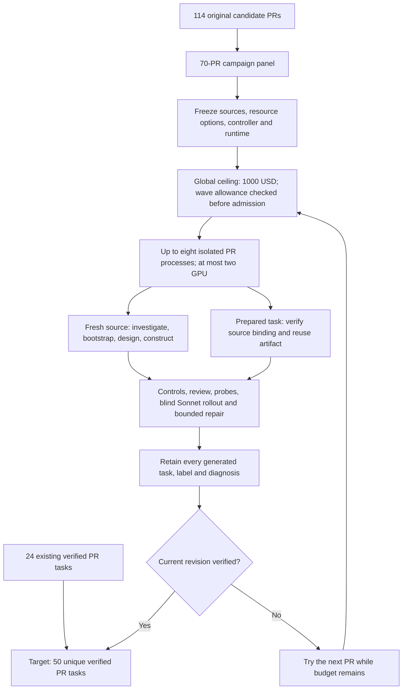

# Tasksmith: retain outputs and expand to 50 verified PR tasks

The September 13 expansion starts with **24 verified PR tasks** and targets **50**
from the original 114-PR list. A frozen panel contains 26 primary candidates and
11 reserves. V7 increases concurrency to eight independent PR controllers,
with at most two GPU controllers. After V8, **38 independently accepted tasks**
are available; 43 unique PRs have generated Harbor tasks in the expansion panel.
The panel includes small CPU workloads and real GPU execution. Acceptance requires
the shared quality profile for the exact revision and inspection of its verifier
and rollout evidence. Solver failure can be legitimate and does not by itself
reject a task.

## Retain every generated environment

The initial historical catalog contains 319 Harbor task copies: 291 reproduction
outputs from 14 recipes and 28 Tasksmith PR outputs. Its second diagnosis snapshot
records 24 verified tasks, 29 tasks needing repair, 265 unverified tasks and one
blocked task. Unverified does not mean bad:
historical controls and assistant ratings remain available, but do not establish
the complete quality profile for those exact originals.

Every copy carries the same `metadata.repo2env.evaluation` table in `task.toml`.
The original configurations, tasks and trial records remain unchanged. The
catalog also references 134 previous Tasksmith revisions, including a stale
intermediate task with an integrity failure; that revision is not accepted.

The current local catalog lives at `workspace/tasksmith-scale50/catalog-v2/`. Its
`SUMMARY.md`, `summary.json` and `index.json` provide counts and task paths.
These copies reference original evidence; they are not a portable replacement
for the complete archived task-and-evidence deliveries. The first catalog remains
unchanged. [Public counts by recipe](evidence/tasksmith-catalog-319.json) contain
no private paths or traces.

The four unfinished Tasksmith outputs now have specific current-revision
diagnoses: TRL #6116 fails its reference control; TRL #6001 tests pooling through
test-side simulation; Diffusers #13921 has a verifier timeout, interrupted oracle
and cache configuration mismatch; Accelerate #3720 has a prepared interpreter
fix awaiting fresh GPU validation. Diagnosis manifests bind the inspected files
and distinguish current findings from earlier revision history.

## First expansion findings

The first three attempts cost **$12.12** in accounted model usage and conservative
compute estimates. All three workers were confirmed terminated and their
reservations reconciled. Two Harbor tasks were generated; one attempt stopped
before bootstrap. These are additional to the historical 319-task catalog.

| PR | Observed result | Disposition |
| --- | --- | --- |
| PEFT #2661 | Reference passes; a repaired alternative passes nine tests and fails an internal boolean assertion. The final correction has an invalid traceback citation. | Retain for review of observable cache behavior versus implementation-specific grading. |
| Accelerate #3529 | The automated profile passes, including both generic probes and a reviewed unsuccessful Sonnet rollout. Its thirteen tests never execute the compiled model. | Exclude this revision from the target until actual execution coverage is verified. |
| Diffusers #13168 | Investigation exhausts fourteen calls with an incomplete source-root profile. | Retain the investigation and retry with complete source coverage; no Harbor task exists yet. |

The accepted target count therefore remains **24**, despite one new automated
profile pass. Raw results are preserved. Separate diagnosis copies under
`workspace/tasksmith-scale50/pilot-diagnoses-v1/` label both generated tasks
`needs_repair`; their manifests distinguish measured outcomes from static
counterexamples that have not yet been executed.

The next runtime incorporates the observed failures into shared behavior:

- Explicit `compiled_execution` requirements demand a wrong-solution probe that
  preserves wrappers but breaks runtime behavior. Requirements live in hashed
  task metadata; adding them creates a new revision and requires fresh evidence.
- Review distinguishes internal-state assertions from the public behavior that
  valid alternative implementations must preserve.
- Probe-only repairs reuse unchanged successful probes after validating their
  complete saved evidence. Failed or changed probes still run again.
- Citation corrections identify the exact failing path and quote within the
  existing bounded correction attempt. Source-profile errors list every omitted
  file and the field that needs correction.
- Explicit Hub aliases preserve offline lookup names while reusing the canonical
  asset download layer. GPU quality releases and reconciles its idle author
  worker before allocating native trial resources.

The first batch's admission controller was drained before further dispatch.
Its remaining **$187.88342** expansion allowance carries forward; a continuation
must not reset the original $200 ceiling.

`batch-v2` is the continuation. Its first two candidates reuse the retained PEFT
and Accelerate tasks with fresh review and execution. Accelerate receives the
explicit `compiled_execution` requirement on a new, hashed task copy. Diffusers
receives complete-source feedback and eighteen bounded author calls. The other
candidate PRs and two-worker concurrency remain unchanged.

The repaired Accelerate task subsequently passed its baseline/reference controls,
the same broken-forward probe, a distinct valid alternative and a judged blind
Sonnet rollout. The broken-forward probe changed from reward 1 on the defective
verifier to reward 0 on the repaired verifier, specifically at the numerical
output assertion. Sonnet passed nine of fourteen tests and failed through genuine
implementation errors. Independent evidence review accepted this helper/API task,
bringing the accepted total to **25**; this does not claim complete
Accelerator/DeepSpeed integration or performance reproduction.

For faster expansion, the frozen v3 continuation uses four total PR controllers
with at most two GPU controllers. The shared budget still covers all previous
attempts. Sonnet remains the default; one metered Opus 4.6 escalation can resolve
a review after its bounded Sonnet calls are exhausted. Literal evidence checks
remain required. Improved feedback identifies quotes absent from every supplied
document, and review guidance separates advisory labels from actual task evidence.
Both remaining v2 jobs finished and their workers were reconciled before the
concurrency change. Design retries can revise the previous draft directly; the
seed remains unvalidated and every submission must pass normal validation.
Review corrections and escalation receive the latest parsed draft, including
after additional source reads.

Accelerate #3098 was also independently accepted, bringing the total to **26**.
Its reference passed 23 tests with one hardware skip; Sonnet passed 22 and failed
one because it retained a function that the instruction explicitly required
removing. The wrong-behavior and valid-alternative probes both behaved as
expected. Diffusers #13168 stopped at 26 passing tests and one invalid fixture;
its next design receives the concrete component-loading correction.

V3 starts with **$176.13069** after the first two phases accounted for $23.86931
and released all their reservations. It has 35 pending PRs and initially admits
four prepared-task recoveries: PEFT #2661, Diffusers #13921, TRL #6001 and
Accelerate #3720. Every retained task receives fresh quality checks.

## V4: fresh PRs and bounded recovery

V3 finished eleven attempts and accounted for **$33.659913**, with no remaining
phase reservations. PEFT #3083 passed independent inspection, bringing acceptance
to **27**. PEFT #2939 passed its automated profile but remains excluded: its
instruction promises the smallest rank meeting an energy threshold, while the
tests check patterns and reconstruction error without independently asserting
the cutoff. A constant-rank escape is an unexecuted hypothesis, not a measured
reward hack. The original result and a separate `needs_repair` copy are retained.

V4 contains **24 fresh PRs and ten recoveries**. The first three fresh PRs run
alongside Diffusers #13168 using its exact previously successful bootstrap
profile. Further fresh PRs precede the remaining recoveries. A prepared profile
binds the PR URL, commits, source diff, resource requirement and complete recipe;
it skips profile rediscovery but still requires fresh remote bootstrap. It does
not import an earlier readiness result.

The runtime incorporates concrete review and repair failures:

- Selected private test assertions precede large reference patches and generic
  helpers in the evidence pack. Review must trace central requirements to those
  assertions and use exact inventory paths for additional reads.
- Overlapping search windows merge within the remaining context allowance.
  Existing cited evidence stays unchanged and omitted windows are explicit.
- The existing repair correction receives the rejected proposal, permitted probe
  changes and remaining calls. Invalid wrong-solution probes remain unresolved;
  the verifier must not be weakened merely to reject a no-op probe.
- Diffusers #13921 has a preserved assisted wrapper revision: the outer timeout
  exceeds the inner timeout and the grader receives image-defined offline cache
  variables. All selectors and scored test IDs remain unchanged. This revision
  still needs fresh execution evidence.

V1–v3 together accounted for **$57.529223**, leaving **$142.470777** for v4 under
the same cumulative $200 ceiling. Historical unresolved holds remain separate
and intact. The final runtime passed **1,226 local tests**, with six skipped
(two optional-dependency suites and four opt-in integration checks).

## V5 preparation: reuse working builds and test model behavior

At the September 14 preparation checkpoint, independently accepted tasks remain
**27**. V4 admission is drained while its active GPU jobs finish. Transformers
#35348 and #36521 passed the automated profile, but independent review holds their
exact revisions for missing numerical coverage of central model behavior. PEFT
#2952 also needs adaptation, sampling and checkpoint-regeneration assertions.
These findings preserve the original results and separate labeled diagnosis
copies; they do not declare unexecuted escape hypotheses to be observed hacks.

The next runtime adds three reusable corrections:

- Mixed source roots include explicit standalone Python files without collecting
  their entire parent directories. This resolves the export failure encountered
  after Diffusers #13168 established 33 reference passes and eight baseline failures.
- Proven uninstalled wrong-solution probes can be corrected within the existing
  repair allowance. Bound receipts and a grounded diagnosis are required; an
  earlier successful installation keeps the counterexample immutable.
- Failed and timed-out builds retain bounded private stdout/stderr and causal
  exception excerpts, so a long echoed Docker command cannot hide the error.

New and repaired neural-model tasks explicitly request `model_behavior` coverage.
The wrong implementation must preserve interfaces and shapes while corrupting a
promised computation. Independent assertions must reject it. Applying that
requirement changes the task identity and requires fresh execution evidence.
Settled rollout success/failure labels must also agree with the recorded reward.
Contradictions enter the existing bounded review correction path; a legitimate
solver failure can still support task acceptance. The 27 earlier accepted tasks
have no label/reward disagreements in their rehashed rollout results.
The combined runtime passes **1,297 local tests**, with four opt-in integration
checks skipped; Ruff, generated prompt references, documentation and wheel build
also pass. This is implementation validation, not acceptance of pending tasks.

V5 preparation preserves successful exact-PR profiles and the complete prior
Diffusers #13168 design. Two source-bound recovery proposals correct a tokenizer
download allowance and a missing test dependency. Nine additional CPU candidates
have been inspected; a tenth reserve requires a separately prepared two-GPU
configuration. None of these proposals constitutes a completed environment.
The launcher must wait for all prior children and provider receipts to reconcile,
then recompute the remaining allowance across every phase before dispatch.

The ordinary expansion ceiling remains **$200**, within the original **$1,000**
campaign authorization. The user authorized a small final overrun, bounded here
to **$50**: up to $250 for the expansion and $1,050 overall only if needed after
the ordinary allowance is exhausted. This reserve is not activated by V5
preparation; historical uncertain holds remain intact.

## V5 results and V6 continuation

V5 finished seven PR attempts. Diffusers #13168 and Accelerate #4059 passed
independent inspection, increasing acceptance from 27 to **29**. Two other
automated profile passes remain on exact-revision holds:

| PR | Independent finding | Next action |
| --- | --- | --- |
| PEFT #2952 | Its wrong-solution control fails during import with an indentation error. Hidden `init_weights` requirements are missing from the instruction, and central numerical coverage is incomplete. | Repair the instruction and behavioral tests, then obtain a functioning semantic counterexample. |
| Diffusers #13226 | Token-selection and entropy assertions do not establish their claimed behavior. Hidden API requirements also account for many solver failures. | Align the public contract and private tests; exercise the actual predicted values and intended entropy distinction. |

Transformers #44160 failed bootstrap. Transformers #36790 reached a successful
bootstrap but exhausted construction repairs. Diffusers #11602 also established
a working bootstrap before stopping without a task. Their source-bound successful
profiles and failure evidence remain available for continuation.

The refreshed panel contains **70 PRs: 29 accepted, ten generated but not
accepted, nine attempted without a task, and 22 unattempted**. Generation yield
is 39/48 (81%) and acceptance yield is 29/48 (60%) among attempted PRs. These
include prior accepted tasks; V5 alone accepted two of seven attempts. Task
copies, revisions and semantic controls do not increase the unique-PR count.

V6 carries two shared fixes:

- Behavioral negative controls need syntax-valid mutations and an actual
  assertion failure during verifier execution. Import/collection failures cannot
  establish rejection of an incorrect algorithm, and review cannot downgrade
  this missing evidence into an optional improvement. This is an execution
  requirement; independent review still checks whether the assertion measures
  the claimed behavior.
- Learner images restore the task virtual environment in both login shells and
  noninteractive Bash. A real L4 smoke identified `su learner` as the boundary
  that replaced PATH. All six checks now pass across direct execution, login
  shells and Harbor tmux, using both `python` and `python3`. See
  [learner runtime](learner_runtime.md) for the emitted setup and validation.

Accelerate #3529's earlier compiled-execution proof predates the new evidence
journal. A bounded revalidation reran its two controls: the broken forward failed
a numerical assertion, and the valid alternative passed. The task and its earlier
baseline, reference and Sonnet evidence remain unchanged. This refresh cost
**$1.438431**; the two learner-runtime smoke attempts cost **$0.777260** combined.
Both amounts are included in the cumulative expansion budget, with their workers
terminated and reservations released.

At V6 launch, the implementation passed **1,324 tests**, with four opt-in integration
checks skipped, and all 17 generated prompt references match their sources. The
next queue pairs retained CPU repairs with small fresh GPU PRs, before large model
additions. Prepared task copies receive the shared runtime correction when
needed and must earn fresh quality evidence. The default three-repair limit,
four-controller limit and two-GPU-controller limit remain unchanged. The queue
continues to retain unsuccessful tasks and diagnoses.

## V6 results and the eight-controller continuation

V6 finished ten attempts and accounted for **$40.408777**, with no remaining
phase reservations. Six passed the automated profile; independent inspection
accepted Diffusers #13921, bringing the total to **30**. Its reference and valid
alternative each passed 40 scored checks. Removing LoRA scaling caused two real
numerical failures. The blind Sonnet attempt made twenty read-only calls and
left the feature unimplemented; the resulting 38 failures reflect the missing
feature, not an environment failure.

The five other automated passes remain retained for repair. TRL #6001's verifier
simulates pooling rather than measuring the production path; PEFT #2939 lacks
the promised energy-threshold rank checks; Transformers #36521 needs central
projector and image-placement assertions. TRL #6139 reveals its exact patch and
does not exercise the required real distributed behavior. Accelerate #3720 has
sound GPU checks, but its rollout was rejected for harmless editor backups
before tests ran. Their original results and separate diagnoses remain available.

V7 begins with four prepared recoveries and four construction candidates,
then refills free slots from the remaining queue. Each PR has its own coding
agent, sandbox, receipts and candidate spending cap. It runs at most eight PR
controllers and two GPU controllers in total. No earlier drained wave is reopened.

Shared changes address observed failures:

- Readiness checks reject absent test-file selectors before expensive builds.
- Saved repair diagnoses appear before large patches in the review context.
- Prepared semantic probe definitions retain their exact task binding and run
  afresh; previous rewards are not imported as new evidence.
- A task that becomes eligible for its blind rollout after probe review now
  receives that rollout within its remaining allowance.
- Private grading accepts bounded regular Python editor backups, discarding
  them only after submission validation; immutable assets stay protected.
- CPU construction emits source directories as artifacts with strict required
  and immutable-file contracts. One earlier control spent 178 seconds collecting
  964 individual files and 150 seconds preparing verification, versus 29 seconds
  in pytest. A fresh Sana CPU control subsequently took 73 seconds overall,
  including 12 seconds collecting/stopping and four seconds preparing grading.
  This is a cross-task comparison, not a controlled same-task speedup estimate.

The integrated runtime passes **1,364 local tests**, with four opt-in live checks
skipped. Ruff, all 17 prompt references, documentation and the wheel build pass.
These implementation checks do not establish acceptance of the queued tasks.

## V7 outcomes and prepared V8 recovery

V7 finished all 18 admitted PRs and then drained. It spent **$64.26**, with no
remaining reservations for that wave. Eleven candidates produced Harbor tasks;
seven received automated passes. Independent inspection accepted two additional
PRs, bringing the total to **32**:

| Accepted PR | Evidence |
| --- | --- |
| Accelerate #3720 | Real two-rank CUDA/NCCL ownership and mesh caching; reference and valid alternative pass 24 checks, wrong cache behavior fails two. Sonnet passes 23 and omits one required state field. |
| Transformers #35348 | Real tiny DINO model; reference and valid alternative pass 14 checks. The wrong classifier formula fails the numerical assertion. Sonnet leaves the requested exports incomplete. |

Nine recovery copies were prepared as **assisted and unverified**, retaining
their original source, reference and failed execution records:

| PR | Prepared correction |
| --- | --- |
| PEFT #2661 | Observe actual DoRA work reuse and invalidation without requiring a particular private cache field. |
| PEFT #2939 | Preserve numerical LoKr rank checks while removing undocumented exception-message matches. |
| PEFT #2952 | Describe the existing initialization option required by the verifier. |
| Diffusers #11602 | Check the initial SCM image/noise mixture numerically before the scheduler updates it. |
| Diffusers #13226 | Exercise public scheduler/pipeline behavior, actual token writeback and unequal-entropy loss inputs; clarify required constructor options. |
| Transformers #36790 | Execute real processor token expansion and numerical image/projector behavior without requiring a private merger implementation. |
| Transformers #36521 | Correct numerical fixture variables and alternative-probe installation; remove private projector-field requirements. |
| TRL #6001 | Call real constructors, production batch methods and async scheduling; replace source-regex grading and an invalid alternative. |
| TRL #6187 | Remove the exact patch from the instruction and require successful two-GPU generation/synchronization before scoring observations. |

V8 ran nine prepared tasks, admitting up to eight controllers and at most two GPU
controllers under a shared **$100** allowance. These tasks reused existing build
artifacts and ran fresh baseline/reference controls, exact prepared probes and
blind Sonnet 4.6 rollouts. Opus 4.6 handles review and repair in this wave; repeated Sonnet reviews
had missed concrete contract and verifier defects. Repairs remain bounded at
three. The practical acceptance bar requires meaningful behavioral evidence,
without demanding exhaustive coverage or solver success.

The runtime also incorporates the observed failures: review checks undocumented
constraints, generated fixtures must complete the intended production path,
repairs can append exact test IDs without reconstructing large contract lists,
and a narrow static guard rejects direct implementation-source grading in the
generated behavioral test. **1,406 local tests pass**, with four opt-in live
checks skipped; prompt references, Ruff, docs and wheel validation pass.

## V8 results and the next twelve candidates

V8 completed all nine PRs for **$28.77**, with no remaining wave reservations or
active workers. Eight passed the automated profile. Independent inspection
accepted **six of nine (67%)**, bringing the total to **38/50**; 43 unique PRs
have Harbor exports. This wave's cost includes recovery validation, not the
previous cost of generating these tasks.

| Accepted PR | Behavioral evidence | Sonnet result |
| --- | --- | --- |
| PEFT #2661 | Real DoRA numerical equivalence, saved tensor work and lifecycle; two wrong implementations fail and two storage alternatives pass. | 10/10 |
| PEFT #2939 | Real adapter conversion and checkpoint reload; known-spectrum rank/product checks reject a constant-rank implementation. | 1/25; exploration ended without source changes |
| PEFT #2952 | Actual PVeRA training, gradients, sharing and checkpoint behavior; deterministic-mean mutation fails stochasticity. | 14/16 |
| Transformers #36521 | Actual Aya vision/projector/language-model path; wrong activation fails numerically and an equivalent reshape passes. | 14/14 |
| Transformers #36790 | Actual processor expansion, projector math and image placement/influence; three wrong implementations fail their intended assertions. | 7/24; exports unfinished |
| TRL #6187 | Real two-rank NCCL, explicit local-device selection and production generation completion; missing synchronization and an exception after synchronization fail. | 12/12 |

Three outputs remain `needs_repair`, with originals and every failed revision
retained. Sana's core SCM verifier now works, but the instruction leaves strength
rounding unspecified; the prepared instruction defines it. LLaDA now tests real
token writeback and loss behavior, but omits public keywords required by its
verifier; the prepared instruction records those signatures and defaults. TRL's
pooling verifier calls the production methods, but its backend fixture supplies
log-probabilities in the wrong tuple position. Three automatic repairs did not
correct that position; a separate corrected fixture is ready for fresh execution.
These copies remain unverified until their new controls, probes and rollouts pass
review.

The next draft contains twelve PRs: those three recoveries, PEFT #3079,
TRL #6139 and #6078, PEFT #3098, and Diffusers #12619, #11281, #11812, #14045 and
#12703. They are all from the original seed list. Prepared designs and corrected
profiles reduce repeated investigation; their fresh bootstrap and feature
validation are still required. The proposed shared allowance is **$80** from
remaining expansion funds, subject to a fresh ledger check before dispatch.

Two observed failures are now addressed in owned code. A narrow patch fallback
restores CRLF source only when both pinned Git blob identities match; it preserves
the original patch and rejects true mismatches. Fixture repair prompts require
the complete production return contract and explicit expansion of unpacked tuple
fields before proposing an edit. **1,419 local tests pass**, with four opt-in
checks skipped. Neither change adds a model call or increases the three-repair
limit.

## Execution and budget



The overall ceiling remains **$1,000**, including $22.43 of historical external
cost; the ordinary global ledger remains $977.57. V7 used the earlier cumulative
expansion allocation of $250. V8 allocates another $100 from unused headroom
inside that same overall ceiling, raising the cumulative expansion allocation
to **$350**. Its own shared allowance is $100, with at least $20 retained outside
the wave at admission. Previous failures, auxiliary checks and uncertain holds
remain charged against these limits. No ledger or allowance resets. Compute
accounting uses conservative estimates rather than provider invoices.

Reservations for builders, authoring, review, repair, solvers and native GPU
allocations share the same SQLite transaction. Worker lifetimes are explicit:
3,600 seconds with a $3 reservation for the smaller CPU profile, and 4,800 seconds
with $4 for larger workers. Model reservations are based on observed costs;
reported overruns remain visible and reduce later headroom.

The coding runtime for new construction remains Pi with Sonnet. V8 uses Opus
review/repair and blind Sonnet rollouts for the prepared tasks listed above.
Each receives fresh quality checks. Fifty independently accepted tasks remain
the target; current counts distinguish prepared inputs from validated outputs.

## Inspect or resume

```bash
repo2rlenv tasksmith show workspace/tasksmith-scale50/batch-v8
repo2rlenv tasks list workspace/tasksmith-scale50/catalog-v2 --status needs_repair
repo2rlenv tasks show PATH_TO_TASK --json
```

The completed V8 wave uses `workspace/tasksmith-scale50/batch-plan-v8.json`; its
configuration, frozen runtime, subprocess logs and final report are under
`workspace/tasksmith-scale50/batch-v8/`. `continuation-v8.json` records its
allowance after all prior phases and exact excluded revisions. Do not resume
admission for the drained V1–V7
batches. Their parent reports may be stale; completed child receipts remain the
source of truth. Completed attempts are not blindly
repeated. Provider or child-process uncertainty stops dispatch until receipts
are reconciled. The controller stops admitting work once the target or batch
allowance is reached.

See [parallel campaign contracts](tasksmith_parallel_campaigns.md),
[evaluation label semantics](task_evaluation_labels.md), and the
[autonomy audit](tasksmith_autonomy.md). Historical acceptance includes assisted
work; the new batch's unattended yield must be measured from its own receipts.
