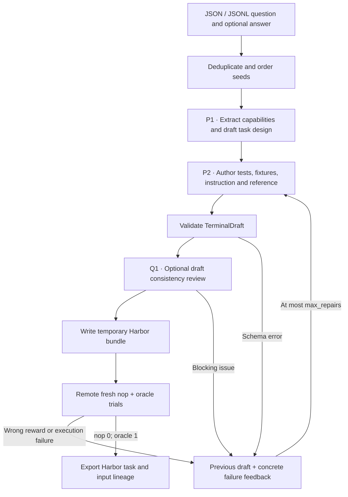

# `terminal_synth` — owned terminal task generation

The first implemented recipe is **`seta_seed2synth`**, adapted from
[SETA](https://github.com/camel-ai/seta/tree/e4715b01174e6c9503fc46120d81dd692ced75e6).
It preserves the released seed-to-idea and test-first datapoint-building stages.
The controller writes structured author outputs as Harbor tasks, executes a fresh
baseline and reference, and returns failures to the builder for bounded repair.

## Pipeline, step by step



`P1`, `P2`, … identify actual model calls. Unlabelled stages are code or remote execution.

**Choose the skill.** A seed is evidence about a real workflow. One design call extracts core_capabilities and a draft_spec; capability extraction and task design are not separate API calls.

**Materialize the task.** The builder returns all files through TerminalDraft. It is told to reason about tests first; the controller does not run a separate test-author call for this recipe.

**Execute and repair.** The controller owns Dockerfile scaffolding, test contracts and reward code. It rebuilds the task remotely and returns actual schema, baseline or oracle failures to the same builder.

## Every prompt and its data

Two authoring calls on the first successful attempt: design, then builder.
With `review_drafts: true`, Q1 adds a consistency review before execution.
Each repair repeats the builder and, when enabled, Q1. See the
[shared Q1 walkthrough](prompt_reference.md#optional-review-before-execution).

| Call | System prompt composition | User / input material | Output | Retry or branch |
|---|---|---|---|---|
| P1 · Design | idea_prompt.md + owned adaptation | Full seed JSON: question, optional answer, source metadata. | TaskDesign: core_capabilities, draft_spec | Invalid schema skips this seed. |
| P2 · Build / repair | builder_prompt.md + shared materialization instructions | Design and accumulated feedback, including the previous draft after a failure. | TerminalDraft | Initial call plus max_repairs retries; default three builder attempts. |

Read the [complete seta_seed2synth prompt reference](https://huggingface.github.io/Repo2RLEnv/pipelines/prompts/seta_seed2synth/) for every retained template, appended instruction, substitution, example and output schema. The [shared prompt guide](prompt_reference.md) explains how to inspect the fully resolved request from a real run.

## Follow one task

Illustration: a question about filenames containing spaces becomes a directory-processing task with awkward filenames, a precise output contract, a shell reference and tests that inspect the resulting files. The seed answer informs design but is not automatically copied into the learner instruction.

## What repeats, what is checked

A completed pair must return exactly 0 for the unsolved task and 1 for the reference. A model self_review is a consistency note, not proof that either execution passed. Parent/source metadata and model requests remain separate from learner-visible files.

An exported bundle is a generation result. Independent leakage review, shortcut probes and blind solver traces belong to the later quality campaign.

## Implementation map

- [`seta_seed2synth/recipe.py`](https://github.com/huggingface/Repo2RLEnv/blob/main/src/repo2rlenv/pipelines/recipes/seta_seed2synth/recipe.py)
- [`terminal/runner.py`](https://github.com/huggingface/Repo2RLEnv/blob/main/src/repo2rlenv/pipelines/recipes/terminal/runner.py)
- [`terminal/draft.py`](https://github.com/huggingface/Repo2RLEnv/blob/main/src/repo2rlenv/pipelines/recipes/terminal/draft.py)
- [`terminal/grade.py`](https://github.com/huggingface/Repo2RLEnv/blob/main/src/repo2rlenv/pipelines/recipes/terminal/grade.py)


## Input and CLI

Supply a JSON array or JSONL of seed objects. Each requires `source`, `title` and
`question_text`; include `answer_text`, `tags`, `url`, attribution and license
metadata when available. Exact duplicate records are deduplicated before model
calls. Seed files are input data, not an upstream package dependency.

```json
{"source":"unix_linux_se","title":"Preserve filenames with spaces","question_text":"A batch script splits paths containing spaces. How can its traversal preserve complete filenames?","answer_text":"Use a delimiter that cannot occur in filenames and keep expansions quoted."}
```

Create a campaign and remote worker as described in [owned recipes](owned_recipes.md),
build the owned runtime with `uv build`, then run:

```bash
repo2rlenv generate --config examples/owned-seta.yaml
repo2rlenv generate --config examples/owned-seta.yaml --resume --json
```

| Option | Default | Meaning |
|---|---:|---|
| `target` | 20 | Number of execution-verified generated tasks |
| `max_candidates` | 40 | Maximum distinct input records to try |
| `max_repairs` | 2 | Builder repairs after the first attempt |
| `seed` | 24 | Deterministic ordering of the input records |
| `max_tokens` | 10000 | Maximum output tokens per builder call |
| `test_timeout_sec` | 120 | Time limit for the generated tests |

Run receipts retain source identity, model requests, task designs, each materialized
attempt, author self-review and actual Harbor trial results. A completed export is
reused only when its content matches the recorded identity. Ambiguous remote
outcomes stop dispatch; they are not silently retried.

## Supported profile and adaptations

The current profile is a Linux CPU container based on Python 3.12, with bash, jq,
sqlite3, git, curl, tmux, uv and pytest. Tasks may install additional dependencies
during image build. Execution is offline. Systemd, privileged networking, GPUs and
external services are outside this profile. Verifiers inspect the final container
state; reference and test files are excluded from the learner image build context.

The upstream idea and datapoint prompt files are retained with their Apache-2.0
license. Owned runtime additions replace folder/tool output with strict JSON,
legacy Harbor metadata with schema 1.3, and network-installing test scripts with
preinstalled dependencies and deterministic JUnit parsing. Five to ten weighted
tests and author self-review remain part of the method; reward is binary. This is
a documented workflow adaptation, not byte-identical upstream execution.

The released collection contains **100 tasks**: 23 retained tasks and 77 new
exports. All 77 new exports have matching baseline reward 0 and reference reward
1 receipts. The expansion recorded **$54.64**, comprising $41.74 of model usage
across 617 calls and $12.90 of estimated worker/build costs. That is **$0.71 per
new export**, including unsuccessful attempts, with no outstanding reservations.
The retained tasks and later independent validation are outside this cost scope.

The new exports map to **77 distinct source questions**. Common source tags are
jq (18), bash (15), find (15), awk (13), sed (13) and tar (10); tags overlap.
Source URLs and question/answer attribution remain attached to the task lineage.
Eight source records lack a recorded content license; the report preserves that
gap instead of assigning an inferred license. See the
[dataset manifest](https://huggingface.co/datasets/HuggingEnvs/repo2rlenv-seta-seed2synth/resolve/main/manifest.json),
[generation economics](economics.md) and
[published Harbor dataset](https://huggingface.co/datasets/HuggingEnvs/repo2rlenv-seta-seed2synth).

Specification audits, adversarial verifier checks and blind solver evaluations
follow generation. A passing author self-review is not independent quality
acceptance. The [release inventory](releases.md) records labels across methods.

See [RFC 0013](../rfcs/0013-seta-seed2synth-recipe.md) and the packaged
`pipelines/recipes/seta_seed2synth/provenance.md` for source mapping and notices.
