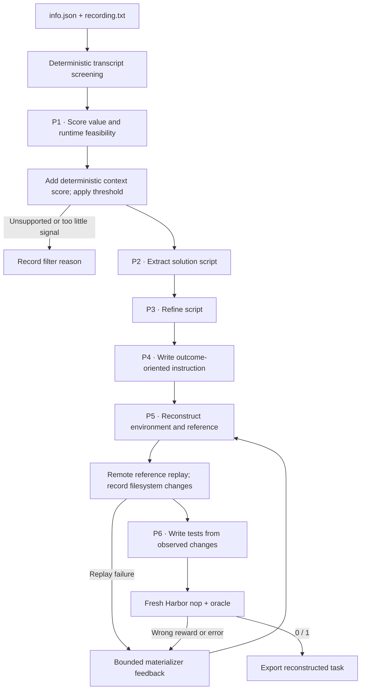

# `terminal_reconstruct / terminalworld`

TerminalWorld reconstructs executable tasks from real terminal recordings.
Its tests are generated from the public goal and observed reference execution.

## Pipeline, step by step



`P1`, `P2`, … identify actual model calls. Unlabelled stages are code or remote execution.

**Screen the input.** Credential/PII patterns filter transcripts before any model call. P1 scores three axes from 0–3, reports tools, command count and supported. A bounded public-link probe supplies the fourth 0–3 context score.

**Recover intent and actions.** Require supported=true, at least three commands and total score ≥ min_score. Extract and refine the script, then write the instruction from metadata and the refined script.

**Observe before verifying.** The environment builder sees transcript evidence and produces real dependencies, starting fixtures and a reference. Only after a successful replay with persistent changes does the test author see bounded initial/final paths, contents and stdout.

## Every prompt and its data

Six calls on a successful first attempt: score, extract, refine, instruction, environment, tests. Filtered inputs use zero or one call.

| Call | System prompt composition | User / input material | Output | Retry or branch |
|---|---|---|---|---|
| P1 · Score | score_long_prompt.md for >40 transcript lines; otherwise score_short_prompt.md | Screened metadata and transcript. | RecordingScore: three scores, reasoning, supported, command_count, required_tools | Default total threshold four out of twelve; not a final quality score. |
| P2 · Extract | extract_prompt.md | Full screened seed. | Script: solution_shell | One call after filtering. |
| P3 · Refine | refine_prompt.md | Extracted Script only. | Script: solution_shell | A separate call. |
| P4 · Instruction | instruction_prompt.md | Title, description and refined solution. | Instruction: instruction | No tests exist yet. |
| P5 · Environment / repair | environment_prompt.md + owned environment adaptation | RecordingDesign, including transcript evidence, and accumulated feedback. | EnvironmentBuild: setup, files, solution_shell, self_review | Reference is executed remotely before P6. |
| P6 · Tests | tests_prompt.md + observed-state adaptation | Instruction, reference script and execution_snapshot. | TestProgram: code | Repeated when a repaired environment reaches replay successfully. |

Read the [complete terminalworld prompt reference](prompts/terminalworld.md) for every retained template, appended instruction, substitution, example and output schema. The [shared prompt guide](prompt_reference.md) explains how to inspect the fully resolved request from a real run.

## Follow one task

Illustration: a recorded Git workflow is turned into a self-contained initial repository fixture. The reference performs the recorded transformation; tests inspect the observed resulting files or Git state. The original transcript is authoring evidence, not the learner prompt.

## What repeats, what is checked

A materialization retry repeats environment construction and, if replay succeeds, test generation. Extraction and instruction are not regenerated by this loop. Opaque TUI, external accounts, GPU and unsupported service requirements are input filters. A provider timeout is an uncertain request, not a low-quality-task verdict.

An exported bundle is a generation result. Independent leakage review, shortcut probes and blind solver traces belong to the later quality campaign.

## Implementation map

- [`terminalworld/source.py`](https://github.com/huggingface/Repo2RLEnv/blob/codex/owned-generation-pipelines/src/repo2rlenv/pipelines/recipes/terminalworld/source.py)
- [`terminalworld/privacy.py`](https://github.com/huggingface/Repo2RLEnv/blob/codex/owned-generation-pipelines/src/repo2rlenv/pipelines/recipes/terminalworld/privacy.py)
- [`terminalworld/recipe.py`](https://github.com/huggingface/Repo2RLEnv/blob/codex/owned-generation-pipelines/src/repo2rlenv/pipelines/recipes/terminalworld/recipe.py)
- [`terminalworld/materialize.py`](https://github.com/huggingface/Repo2RLEnv/blob/codex/owned-generation-pipelines/src/repo2rlenv/pipelines/recipes/terminalworld/materialize.py)
- [`terminalworld/worker.py`](https://github.com/huggingface/Repo2RLEnv/blob/codex/owned-generation-pipelines/src/repo2rlenv/pipelines/recipes/terminalworld/worker.py)
- [`terminal/runner.py`](https://github.com/huggingface/Repo2RLEnv/blob/codex/owned-generation-pipelines/src/repo2rlenv/pipelines/recipes/terminal/runner.py)

## Run and supported profile

Provide a directory containing one or more native recording folders, each with
`info.json` and `recording.txt`. Metadata includes `title`, `description`, `id`
and `url`. To acquire public source recordings from numeric IDs:

```bash
python -m repo2rlenv.pipelines.recipes.terminalworld.source \
  --ids-json workspace/recording-ids.json --out workspace/recordings
repo2rlenv generate --config examples/owned-terminalworld.yaml
```

The ID file is a JSON list such as `["100135"]`. Acquisition fetches text and
metadata only, checks robots.txt and records download failures. Existing inputs
are reused. Export the generated task bundles rather than the raw recordings.

The first runtime profile supports a single offline CPU Linux container. It
installs real dependencies during build and can synthesize missing input files
when the recorded workflow provides enough evidence, as permitted by the native
builder. It excludes opaque TUI, GPU, privileged networking, multi-service and
external-account workflows. The value score is an upstream input-selection
stage, separate from the later task-quality audit.

Options include the shared terminal generation bounds and `min_score` (default
four out of twelve, the native bronze threshold). The snapshot records file
changes and bounded content prefixes. The test author consumes that execution
evidence before the fresh baseline/reference trials.

The target is **20 generated tasks**. Partial-solution probes, independent
leakage/shortcut checks and blind solver rollouts follow the generation campaign.
An export does not claim the upstream three-trial acceptance result. Cloud
workers, metering and Rich/JSON progress use the [shared interface](owned_recipes.md).

Credit: [TerminalWorld](https://github.com/EuniAI/TerminalWorld), Apache-2.0,
commit `784698ba93735470ce1664bff2ec44bcd7b28e15`. See
[RFC 0019](../rfcs/0019-terminalworld-recipe.md) and packaged
`recipes/terminalworld/provenance.md` for the exact source map and adaptations.
