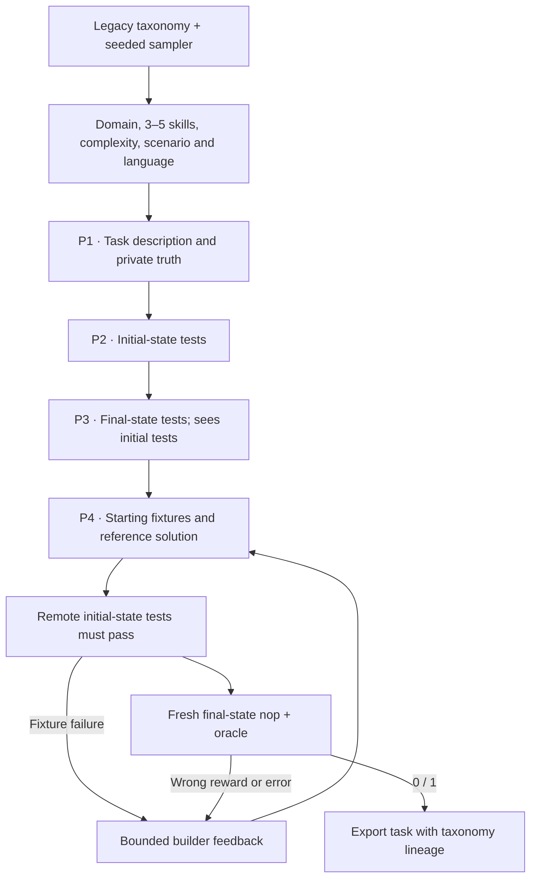

# `terminal_synth / tmax`

TMax composes terminal skills into new tasks and checks that the starting
environment contains the fixtures described by the task.

## Pipeline, step by step



`P1`, `P2`, … identify actual model calls. Unlabelled stages are code or remote execution.

**Sample requirements.** The owned sampler retains legacy TMax domain/skill axes, weighted languages and optional real-software anchors. This profile uses the first three task-complexity categories.

**Separate starting and solved states.** P1 produces a public description and private truth. P2 checks what must exist before solving. P3 sees those tests and describes the completed state.

**Build and test both states.** The builder creates the starting fixtures and reference; initial-state execution happens before final-state baseline/oracle trials. The common builder can repair an inconsistent expectation using execution feedback.

## Every prompt and its data

Four calls on the first successful attempt: template, initial tests, final tests, environment/reference builder.

| Call | System prompt composition | User / input material | Output | Retry or branch |
|---|---|---|---|---|
| P1 · Template | template_prompt.md with domain_label and DOMAIN_MODULES substitutions; v2_block is empty | Sampled taxonomy requirements. | TaskTemplate: description, truth | Legacy corpus only. |
| P2 · Initial tests | initial_prompt.md + shared adaptation | Description, private truth; initial_tests is null. | TestProgram: code | Five to ten top-level pytest tests. |
| P3 · Final tests | final_prompt.md + shared adaptation | Description, truth and generated initial_tests. | TestProgram: code | Separate model call. |
| P4 · Build / repair | environment_prompt.md + templates.builder_prompt additions + common materialization | Complete TemplateDesign and failure feedback. | TerminalDraft | Default initial build plus two repairs. |

Read the [complete tmax prompt reference](prompts/tmax.md) for every retained template, appended instruction, substitution, example and output schema. The [shared prompt guide](prompt_reference.md) explains how to inspect the fully resolved request from a real run.

## Follow one task

Illustration: sampled time-series, encoding and aggregation skills become a sensor-data task. Initial tests check the supplied input fixture; final tests check the requested cleaned aggregate; the reference performs the transformation.

## What repeats, what is checked

P1–P3 run once per sampled design. Failed initial fixtures or final baseline/reference checks return to P4. The first runtime supports text fixtures and an unprivileged offline solver. The reward is binary all-required-tests success; stored weights do not make the current grader fractional.

An exported bundle is a generation result. Independent leakage review, shortcut probes and blind solver traces belong to the later quality campaign.

## Implementation map

- [`tmax/sampler.py`](https://github.com/huggingface/Repo2RLEnv/blob/codex/owned-generation-pipelines/src/repo2rlenv/pipelines/recipes/tmax/sampler.py)
- [`tmax/recipe.py`](https://github.com/huggingface/Repo2RLEnv/blob/codex/owned-generation-pipelines/src/repo2rlenv/pipelines/recipes/tmax/recipe.py)
- [`terminal/templates.py`](https://github.com/huggingface/Repo2RLEnv/blob/codex/owned-generation-pipelines/src/repo2rlenv/pipelines/recipes/terminal/templates.py)
- [`terminal/runner.py`](https://github.com/huggingface/Repo2RLEnv/blob/codex/owned-generation-pipelines/src/repo2rlenv/pipelines/recipes/terminal/runner.py)
- [`terminal/preflight.py`](https://github.com/huggingface/Repo2RLEnv/blob/codex/owned-generation-pipelines/src/repo2rlenv/pipelines/recipes/terminal/preflight.py)
- [`terminal/grade.py`](https://github.com/huggingface/Repo2RLEnv/blob/codex/owned-generation-pipelines/src/repo2rlenv/pipelines/recipes/terminal/grade.py)

## Run and supported profile

Run `repo2rlenv generate --config examples/owned-tmax.yaml`. The seed file is a
JSON sampler configuration, for example:

```json
{"corpus_kind":"legacy","count":40,"seed":24,"domains":["data_processing","file_operations","data_querying"],"languages":["Python","Bash"]}
```

Omit `domains` or `languages` to retain the full corresponding taxonomy. The
sampler preserves the upstream legacy axes and weighted language selection;
restrictions select a conditional subset. Configuration and sampled axes are
recorded with the generated artifacts. Options include `target`,
`max_candidates`, `max_repairs`, `seed`, `test_timeout_sec` and `max_tokens`.

This first profile generates text fixtures in a single CPU Docker container.
All dependency installation happens during image build. The solver runs as
`user`, without runtime internet, and can edit `/workspace` and `/home/user`.
Initial-state tests, final-state tests and the reference stay outside the
learner image. The builder receives execution errors for bounded repairs.

The campaign target is **20 generated tasks**. It runs the native initial-state
check and a fresh Harbor baseline/reference pair. Detailed reward-hack review,
blind solver trials and acceptance follow after all recipes reach their
generation targets. TMax v2 multimodal fixtures, metric verifiers and the
upstream large sampled-solution stage are outside this first profile.

Use the [shared worker, budget and progress interface](owned_recipes.md) for
Modal or Daytona. Credit: [TMax](https://github.com/hamishivi/tmax), Apache-2.0,
commit `7387d2f9142397a458dc39f0827a2ab0b4c03cda`. See
[RFC 0018](../rfcs/0018-tmax-recipe.md) and packaged
`recipes/tmax/provenance.md` for retained files and adaptations.
