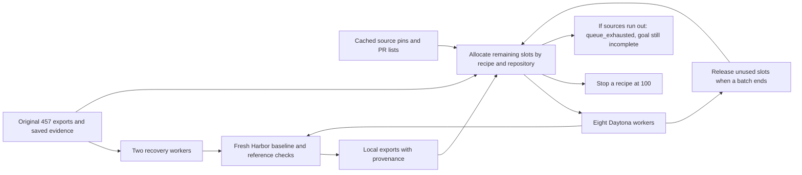

# Wave 1: six local 100-task collections

Started 14 September 2026. **Generation completed: 600 local Harbor exports,
100 per recipe**, as of 15:22 UTC. All campaign workers are terminated. The
dated checkpoints below preserve the recovery history; they are not live status.
The initial Modal workers were stopped on 14 September following the user's
provider preference. Daytona passed image build, file transfer, offline execution,
fresh reset and a standalone Harbor baseline/reference pair before expansion resumed.

The user approved generating the six Wave 1 recipes locally before a consolidated
implementation/documentation PR. Tasksmith's existing 50 are outside this campaign;
Hub publication and the other eight recipes are deferred. SEC-bench remains excluded.

| Recipe | Retained exports | Total exports | New exports produced |
|---|---:|---:|---:|
| SWE-smith | 24 | 100 | 76 |
| R2E | 20 | 100 | 80 |
| SWE-gen | 20 | 100 | 80 |
| SWE-next | 20 | 100 | 80 |
| R2E-Gym | 20 | 100 | 80 |
| SCALER | 20 | 100 | 80 |

Counts are distinct exported Harbor tasks, not quality acceptance. Retained tasks
keep their original hashes and evidence. Revised tasks replace their predecessor
in the selected collection rather than increasing its count.

## Completion and audit

The final inventory contains **124 retained tasks and 476 new exports**. All 600
pass bundle integrity checks and Harbor task parsing; the retained `task.toml`
files also match their recorded hashes. The local evidence is
`workspace/owned-wave1-100/reports/completion-600.json`, with economics in
`reports/progress.json` and the [per-recipe reports](economics/wave1/README.md).

Of the 476 new exports, **388 have hash-matched standalone Harbor baseline 0 and
reference 1 receipts**: all 80 new tasks from each of R2E, SWE-gen, SWE-next and
R2E-Gym, plus 68 of SWE-smith's 76. Eight earlier SWE-smith Boltons pilot exports
have generator-level checks but no matching standalone pair in this campaign.
The 80 new SCALER exports have recipe-native evidence; this audit does not infer
standalone Harbor verification from it. Retained task execution evidence remains
in its original campaigns. None of these counts establishes independent semantic
quality, reward-hack resistance or blind solver success.

The Wave 1 ledger records **$75.899214 accounted, $2.25 reserved for uncertain
earlier model calls, and $71.850786 available** within its $150 limit. Accounted
cost includes estimated cloud/build charges and recorded failed attempts. It
excludes the earlier cost of the 124 retained tasks and interactive assistant
usage. The accounted campaign cost divided by 476 new exports is approximately
**$0.159 per export**; it is not a forecast for other pipelines or an invoice.

At 15:36 UTC the user approved reserving up to **$40 of the unused allowance for
Wave 2's final Endless Terminals expansion**. This leaves $31.850786 unallocated
in the parent ledger at dispatch. The transfer does not change the Wave 1
generation cost above or increase the combined budget. Live ledger totals include
the child allocation; `progress.json` separates it in `cost_attribution` to avoid
charging it to Wave 1 exports or counting parent and child costs twice.

Recovery added reusable fixes for Git-free package versioning, bounded authoring
context, historical test-package fixtures, explicit pytest options and transient
read retries. 57 relevant regression tests and targeted lint checks passed.
Remote recovery exports provide execution evidence for the packaging and fixture
repairs. Frozen runtime receipts preserve the code used by each individual run.

## Execution and spending

Use a separate $150 Wave 1 ledger; never reset the previous campaign's ledger.
The historical top-up generation forecast is $70.41, including allocated shared
compute, excluding new bootstraps and repairs. This is a planning estimate, not
an invoice or a promise of that marginal cost on unfamiliar repositories.

Start with small expansion batches on new repositories and then fill to 100.
All new images, repository code and generated/reference programs execute on remote
Daytona workers. The initial Modal pilots retain their original provenance;
their workers are terminated and their costs reconciled during migration. There
is no automatic fallback to Modal. Artifacts, model receipts and reports are stored under
the ignored `workspace/owned-wave1-100/` directory. No Hub upload is part of this wave.
Reserve worker and model spend before dispatch, preserve uncertain reservations,
and reconcile terminated workers using explicit estimates or provider receipts.

The provider switch is recorded in `reports/provider-migration.json`. New queue
dispatches enforce `provider-policy.json`; the current plan is `daytona-queues.json`.
Completed Modal exports and paid model responses retain their original evidence.
Interrupted candidates are retained for diagnosis and excluded from automatic
re-authoring. One interrupted R2E model request retains a $0.75 uncertain reservation.
Daytona worker estimates use its [published resource rates](https://www.daytona.io/pricing)
and record a separate conservative image-build allowance; they are not provider invoices.

### Parallel expansion

On 14 September the user requested more concurrent generation. The pool increased
from six to sixteen Daytona workers: up to three different repository batches per
repository recipe, plus the existing SCALER expansion. The provider usage endpoint
reported a regional quota of 250 vCPUs and 500 GiB RAM; sixteen workers reserve
64 vCPUs and 128 GiB. The campaign budget remains $150.

The original six generation processes were adopted without restart. The dispatcher
now allocates the remaining task count before each batch starts, subtracting the
unfinished allocations of other active batches. It permits one active batch per
recipe/repository pair, excludes previously attempted candidates, and applies the
100-task recipe and 25-task repository caps. Failed or partially successful batches
release their unused task slots when their processes finish. Spend reservations
continue to use the shared transactional budget ledger.

The allocation policy lives in `src/repo2rlenv/campaigns/scheduling.py`. Its tests
cover simultaneous allocations, per-repository limits, partial batch completion
and run receipts advancing ahead of the inventory snapshot. The campaign's local
plan is `daytona-parallel-plan.json`; `parallel-dispatch.json` records process IDs,
worker ownership, active allocations and pending batches. The former per-worker
queue records remain available with a `transferred` state. Provider failures with
uncertain remote execution quarantine the worker for inspection rather than
silently relaunching the same paid operation.

### Recovery checkpoint — 2026-09-14, 13:00 UTC

The inventory contains 442 exports: SWE-smith 69, R2E 60, SWE-gen 66,
SWE-next 84, R2E-Gym 63 and SCALER 100. This includes 124 retained tasks.
These are generation counts, not quality acceptance counts.

Four unaffected Daytona batches continue: R2E on Packaging, Funcy and
ItsDangerous, and SWE-gen on Packaging. Ten surplus idle workers were terminated
and their reservations reconciled. The dispatcher retains limited warm capacity
and preserves workers with uncertain remote execution for evidence recovery.
Its adopted-job records now use a separate copy of the original plan so progress
updates cannot corrupt the plan required for a restart.

Two Toolz issues explain failed exports. R2E's coverage hook used a hardcoded
top-level generated-test path, despite the worker placing tests in a nested
directory. The source fix and regression test pass, but running batches use a
frozen runtime: remote deployment and recovery validation remain pending.
Separately, a Git-dependent bootstrap command was also used to build Harbor
bundles after Git history had been removed. Standalone installation and package
version handling still need repair. Existing paid test and instruction responses
are retained for recovery; the interrupted Toolz worker is isolated from new jobs.

Packaging also needs bounded authoring context: large parameterized-test evidence
exceeded an extraction limit in SWE-smith and the model context limit in R2E-Gym.
The SWE-smith evidence archive has been recovered with an explicitly recorded
larger extraction bound. This has not yet produced recovered exports.

The checkpoint ledger records $46.11 accounted, $28.50 reserved and $75.39
unallocated within the $150 Wave 1 cap. Accounted cloud amounts are estimates,
not provider invoices; reconciliation moves reservations into accounted costs.
The local `reports/progress.json` and per-recipe economics reports provide the
timestamped breakdown. Live counts and reservations can advance after this note.

### Recovery and replenishment — 14 September, 14:26 UTC

The refreshed inventory is **485/600 exports**: SWE-smith 88, R2E 73,
SWE-gen 73, SWE-next 86, R2E-Gym 65 and SCALER 100. This is a timestamped
checkpoint, not the final result. The current budget is approximately $58.40
accounted, $33.00 reserved and $58.60 available within the unchanged $150 cap.

Two recovery workers reuse Toolz and Packaging candidate evidence. Toolz reuses
paid instruction responses when their identity matches the retained draft;
Packaging authors instructions from bounded evidence. Every recovered export
still requires a fresh standalone Harbor baseline/reference pair. Toolz's
Git-dependent version is now frozen from recorded package metadata before the
Git-free task image is built. Its learner install command no longer fetches Git
history. Nested test packages are omitted from the learner package manifest.

Eight additional workers run R2E, SWE-gen, SWE-next and R2E-Gym on Cachetools and
SQLParse, with Schedule and SortedContainers queued as fallback sources. Repository
pins, inspected packaging files and merged-PR lists are cached in
`inputs/expansion02/`. Schedule is excluded from the R2E queue pending support for
explicitly collecting a generated test alongside a single-file test suite.

`parallel-plan-expand02.json` and `parallel-dispatch-expand02.json` record this
new queue without rewriting the original dispatch history. No SWE-smith batches
are allocated by the new pool because its two recoveries own the remaining slots.
SCALER has already reached 100. Each new worker reserves $2.50 against its four-hour
resource limit, including the existing $1 image-build allowance.

The frozen v7 wheel has SHA-256
`356beefaca4a568bc6b43358d177d4a71bc484975c9db2e17cc26c6daa09da55`.
It includes bounded model context and up to three retries for observational
Daytona reads/downloads and GitHub read timeouts. Job dispatches and ambiguous
model requests are not silently replayed. Large parameterized test lists remain
complete in private verifier contracts; only authoring context is bounded.
A subsequent GitHub flag-parsing hardening is tested in source and will enter the
next runtime; running jobs retain the exact v7 code they started with.

48 relevant regression tests passed for version freezing, context bounds, read
retries, recipe contracts, metering, scheduling and artifact/worker lifecycle.
Actual fresh Toolz Harbor exports provide the remote check for the packaging fix.

## Diversity and validation

### Initial queue exhausted — 14 September 2026

The initial queue finished with **456 exports**: SWE-smith 69, R2E 70, SWE-gen 70,
SWE-next 84, R2E-Gym 63 and SCALER 100. No initial-queue generation process is still
running. The queue's `completed` state means that its jobs have ended; it does not
mean all six 100-task objectives were achieved. There are 144 exports still needed.

The last R2E Packaging, R2E Funcy and SWE-gen Packaging runs stopped on Anthropic,
Daytona and GitHub request timeouts respectively. Their earlier exports remain
retained. Recovery must inspect each operation's evidence before retrying;
ambiguous model requests still retain their budget reservation.

A remote Toolz coverage probe reused an existing paid test unchanged and measured
50% branch coverage instead of the previous false zero. The repaired hook works,
but this test still does not meet the unchanged 80% threshold. This probe does
not create an accepted task. The Toolz worker was stopped after confirming no
remote jobs remained active and that local evidence had been downloaded.

Wave 1 recovery remains open alongside the separately funded
[Wave 2 pilot](wave2_pilot.md). See the local `reports/queue-checkpoint.json` for
the closing queue inventory, timeout causes, worker states and budget snapshot.

Subsequent reconciliation recovered one R2E Funcy task by downloading its already
successful remote oracle run. Its unchanged bundle matches both baseline 0 and
oracle 1 receipts; no model request or trial was repeated. The inventory is now
**457/600**, including 71 R2E tasks. All Wave 1 workers have been terminated after
retrieving the interrupted evidence and retrying previously unconfirmed cleanup.
The local `reports/recovered-r2e-funcy-task.json` records the recovery; the generation
and broader quality objectives remain incomplete.

Repository tasks should cover at least four repositories per recipe where source
availability allows. Prefer at most 25 tasks per repository. Record exceptions
instead of silently padding the collection with duplicate PRs/functions. Track
cross-recipe overlap separately: methods may legitimately operate on the same
source, but that does not make their tasks independent evaluation examples.

SCALER remains a reasoning track. Record family, concrete instance identity,
difficulty and seed; preserve string outputs and declared numeric tolerances.

Require Harbor structure validation and record baseline/reference checks. Inspect
the first diverse expansion examples before scaling a recipe. Keep failed and
unverified candidates with their reason; do not equate export count, baseline
contrast, sampled review or Sonnet success. A sound task need not be solved by Sonnet.

## Per-recipe documentation contract

Each recipe report must record:

- Its actual stage diagram, prompts, model roles and implementation differences
  from the cited upstream method.
- Input sources and revisions; repository, language, family, seed and difficulty
  distributions; duplicate and near-duplicate observations.
- Attempted, exported, execution-verified, reviewed and failed counts, with examples.
- Generation, bootstrap, verifier, rollout and repair costs, including failures and
  retries; shared-cost allocation; mean, median and p90 cost and runtime where observed.
- Cold/warm runtime, cache behavior, concurrency, throughput and provider failures.
- Verifier pitfalls, observed shortcuts, limits and interventions; distinguish
  pipeline fixes from task-specific assistance.
- Exact commands/configurations, runtime and task hashes, upstream credit, and
  local evidence locations. Model receipts remain outside learner bundles.

Update economic tables from the ledger and run receipts; do not extrapolate a
five-task pilot acceptance fraction to the full collection.

## Profile repairs for the replenished queue

Historical Schedule snapshots import the external `mock` package even though the
current checkout does not. Its failed candidates are retried with `mock==5.2.0`,
whose distribution was checked before dispatch. This changes the image profile,
not repository source or test assertions. The queue supplement admits these
retries only when the original candidate has no model-dispatch receipt.

R2E-Gym originally flattened selected tests into `r2e_tests/test_1.py`, which lost
relative imports such as `from . import CacheTestMixin`. The v8 runtime preserves
the original package tree and companion fixtures beneath `r2e_tests/`, executes
only the selected test modules, and excludes the entire companion tree from the
learner image. `private_test_paths` separates hidden assets from the list of test
modules to execute. A regression test executes a synthetic package with relative
imports and proves that an unrelated failing module is not collected; bundle
checks verify the helper remains private.

Repository profiles also accept explicit `pytest_args`, carried into both the
generation check and the exported verifier contract. The new Pydash profile uses
`-o addopts=` to omit CI reporting/plugin options and excludes its mypy-only test
directory. Runtime tests and R2E's separate 80% generated-test branch coverage
requirement remain in place. This runtime-test scope is recorded in the profile;
it is not a claim of complete type-checking coverage.

Pydash at `f46de3669742c075e5379c1e193c86c1c2c70dc2` supplies a further source for
R2E and historical recipes. New runs use frozen v8 SHA-256
`ce3ba3199d6886bf12ce15998c93d5b324259b9f3ca3f9a14292ac8d0d17e856`;
existing jobs continue with their original runtime. The local dispatcher consumes
hashed queue supplements while preserving the original plan, process identities
and allocation limits. A drained source queue remains incomplete until its recipe
has reached its explicit target.
