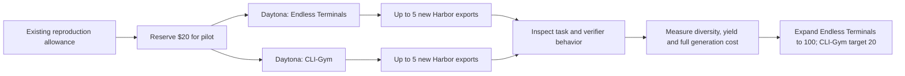

# Wave 2: Endless Terminals and CLI-Gym pilot

Started 14 September 2026; generation finished at 16:43 UTC. Final inventory:
**100 Endless Terminals exports and 25 CLI-Gym exports**. All generation workers
are terminated and all Wave 2 child costs are settled. Both datasets are published
under HuggingEnvs with complete Harbor task folders. Wave 1 has completed its six
100-task collections. The original pilot targeted five new exports per recipe;
its results and subsequent expansions are recorded below. The updated objective
is 100 Endless Terminals tasks and 20 CLI-Gym tasks. CLI-Gym had already exceeded
that reduced target when stopped, so all 25 are retained and no further jobs run.
The earlier 20 exports per recipe are retained unchanged and recorded by hash;
their presence does not establish quality acceptance.

## Why these two recipes

The [earlier quality pilot](quality_pilot.md) found five usable examples out of
five inspected Endless Terminals tasks and five usable CLI-Gym revisions after
packaging repairs. These small samples support another generation batch; they do
not estimate the quality of 100 future tasks. Other terminal recipes retain
specific verifier or specification defects, so this pilot does not scale them.

| Recipe | New input | Generation path | Checks before export |
|---|---|---|---|
| Endless Terminals | Native taxonomy, five initial workflow categories | Requirements → task and private reference description → initial tests → final tests → Docker fixtures and shell solution | Initial fixtures satisfy setup tests; unsolved task fails completion tests; reference passes |
| CLI-Gym | Boltons at `961dcff3f42e73b245aef65e377fe82763b257bb` | Healthy repository → disruption goal → destruction/recovery scripts → observed symptoms → instruction | Original source/tests remain intact; damage causes failure; recovery restores tests; fresh Harbor baseline/reference contrast |

Endless Terminals begins with log analysis, SQLite operations, Makefile tasks,
JSON schema validation and archive extraction. Its native sampler seed was
selected before model calls to give five distinct initial categories. Category
selection restricts this pilot to offline CPU workflows; it is not a uniform
sample of the entire taxonomy. Complexity and scenario follow the native sampler.

CLI-Gym broadens beyond the prior Click corpus. Its image builds an offline wheel
cache for Boltons and pytest, and the existing exporter preinstalls `tmux` for
Harbor's solver adapter. The generation pilot does not itself run a blind solver.



## Bounds and accounting

- Two independent Daytona workers, each with four CPUs and 8 GiB RAM. No local
  repository execution and no Modal fallback.
- Sonnet authors task content. Each recipe examines at most ten candidates for
  five exports, with at most three execution attempts per candidate.
- The $20 pilot allocation is reserved in `workspace/owned-campaign/budget.sqlite3`.
  A child ledger enforces that same $20 allowance. This allocation uses existing
  funds; it does not increase a limit or draw from Wave 1's separate $150 ledger.
- Parent and child accounting describe the same money. Do not add the parent
  reservation to the child's costs. After worker cleanup, the parent reservation
  settles to the child's recorded cost only if all child operations are settled.
  Uncertain provider charges remain reserved for reconciliation.
- Workers stop when their batch finishes. Uncertain remote execution retains its
  worker and evidence for inspection rather than launching a duplicate operation.

Prior measured generation estimates were about $0.65 per Endless Terminals export
and $1.31 per CLI-Gym export, including an allocated compute proxy. They are
historical planning estimates, not forecasts or provider invoices. The new pilot
will measure its own calls, failed attempts and resource lifetime. The initial proposal to expand
both to 100 was **not funded by the $20 pilot allocation**; the later CLI-Gym
reduction is recorded below.

## Evidence and commands

The ignored `workspace/owned-wave2-pilot/` directory retains the plan, frozen wheel
and controller source, input draws, original inventory hashes, configurations,
worker receipts, model requests, execution results and local exports. The wheel's
SHA-256 is `893b16bbb09ddc8f889e5320f4a6c12515106477e5b09de2da2f5f51f9c3bbf2`.
The campaign controller owns process IDs and cleanup in `controller.json`.

Individual runs use the existing CLI:

```bash
repo2rlenv generate --config workspace/owned-wave2-pilot/configs/endless-terminals-daytona-pilot-01.yaml
repo2rlenv generate --config workspace/owned-wave2-pilot/configs/cli-gym-daytona-pilot-01.yaml
```

These commands require the recorded runtime and worker. Do not launch another
copy while the campaign controller owns the runs. Explicit resume must preserve
the original configuration, runtime and operation identities.

The runtime and recipe contracts passed 38 relevant local tests before dispatch.
Generation produces `quality_status = "exported"`; it does not mark a task
quality-accepted. The next review examines real script execution, protected
expected data, instruction/verifier consistency and task diversity, with targeted
counterexamples where needed. Sonnet success is not a requirement for a sound task.

The original source maps, RFCs, credits and complete prompts remain in
[Endless Terminals](endless_terminals.md) and [CLI-Gym](env_repair.md).

## Pilot result — 14 September 2026

Both batches finished in approximately 25 minutes and both Daytona workers were
terminated. The pilot exported **nine new tasks**, one short of its ten-task
target. All nine immutable export hashes match completed Harbor receipts with
unsolved reward 0 and reference reward 1. This verifies the generation controls;
independent semantic review, shortcut probes and blind Sonnet rollouts remain pending.

| Recipe | Candidates attempted | New exports | Total with 20 retained | Model calls | API cost | Estimated compute/build cost | Total per new export |
|---|---:|---:|---:|---:|---:|---:|---:|
| Endless Terminals | 5 | 5 | 25 | 23 | $1.91 | $1.14 | $0.61 |
| CLI-Gym | 10 | 4 | 24 | 41 | $3.18 | $1.14 | $1.08 |

Total accounted cost is **$7.370422**: $5.086307 in model usage plus $2.284115
in estimated cloud/build costs, including a conservative $1 image-build allowance
per worker. There are no outstanding pilot reservations. The parent reservation
settled to the same $7.370422, releasing the unused $12.629578; these are the same
funds and must not be counted twice.

The pilot made 29 Harbor trials: 21 for Endless Terminals, including setup checks
and failed attempts, and eight final baseline/reference trials for CLI-Gym.
CLI-Gym's separate destruction/recovery evaluations are additional remote tests,
not included in that Harbor trial count.

CLI-Gym exhausted its ten candidates. Six candidates failed bounded
materialization: two ended at the protected-file/control-interpreter guard, two
had failed recovery, one ended with a shell syntax error, and one did not satisfy
the required damage/recovery contrast despite a passing recovered suite. Failed
candidates and their model costs remain recorded. The four exported instructions
all concern Python import or pytest failures, so defect diversity needs attention
before expansion. A passing reference alone does not establish a diverse corpus.

Evidence: `reports/pilot-completion.json`, `reports/export-controls.json`, per-run
model and trial receipts, and each worker's cost receipt under the local campaign
directory. Next, inspect the nine task/verifier pairs, improve CLI-Gym's disruption
selection using these failures, and fill its missing pilot slot before scaling.

## Expansion and CLI-Gym scope change — 14 September, 14:26 UTC

The expansion campaign is `workspace/owned-wave2-expand01/`, using a fresh $20
child ledger reserved from the same parent reproduction allowance. It initially
launched four Daytona workers: three Endless Terminals batches and one CLI-Gym
batch, each targeting five exports. The runtime is the frozen v7 wheel recorded
in the [Wave 1 recovery note](wave1_scale100.md).

The user subsequently lowered CLI-Gym's objective to **20 environments** because
of its cost. Its prior 24 exports already exceeded that target. One additional
export finished before the cancellation, bringing the retained total to **25**.
The controller was interrupted and its Daytona worker terminated; a second
candidate's interrupted reference trial is retained but is not counted as an
export. `scope-change.json` and `reports/cli-gym-cancellation.json` record the
request, process identity, worker cleanup and unfinished evidence. No more
CLI-Gym generation is scheduled. Existing artifacts are not deleted to force
an exact count of 20.

The three Endless Terminals workers continue with separate sampler seeds and
15 offline categories. At this checkpoint they have produced four new exports,
bringing Endless Terminals to **29** including the pilot and retained tasks.
Each worker uses at most three materialization attempts per candidate. The
remaining budget question now concerns Endless Terminals only; the earlier
estimate for generating another 76 CLI-Gym tasks no longer applies.

The controller's original plan and interruption receipt remain immutable history.
Its CLI-Gym job may show `needs_inspection` because an interrupted Harbor trial
was deliberately stopped; the cancellation report establishes that the worker
was terminated and this job must not be resumed. New exports retain the
`exported` quality label and require later semantic review.

## First expansion result and next funded batch

The first expansion finished at 14:43 UTC with **15 Endless Terminals exports**
and one CLI-Gym export before its requested cancellation. Endless Terminals now
has **40** retained exports; CLI-Gym has **25** and its target is satisfied.
All 16 new export hashes match completed baseline-0/reference-1 receipts, and the
recorded result-file hashes were checked. These controls do not establish semantic
quality acceptance.

The expansion cost is **$11.090176**, fully settled with no outstanding child
reservations. Model usage accounts for $6.630320: $6.263504 for Endless Terminals
and $0.366816 for CLI-Gym, including its interrupted candidate's completed model
calls. Resource lifetime and image-build estimates account for $4.459856. Endless
Terminals made 93 model calls across its three runs; CLI-Gym made seven. All four
workers were terminated. The cancelled job's final controller state is reconciled
as `cancelled`; its original interrupted evidence and completion report remain.

The released funds brought the parent allowance to $13.022789. A new **$13**
reservation funds `workspace/owned-wave2-expand02/`, targeting **14 more Endless
Terminals exports on two workers**, seven each. No campaign limit was raised.
Workers have a 90-minute bound and reserve $1.60 each, including the image-build
allowance. This avoids tying up four hours of resource reservations for a short
batch. Each run examines at most 14 candidates with at most three materialization
attempts, and stops once its seven exports are complete.

The new frozen runtime SHA-256 is
`da3360ce3a0a5fd215038af1ff5ce1a2c85015c1b389c4d3131ede731c5b2e2b`.
It additionally retries transient HTTP read failures, while authentication and
not-found errors still fail immediately. The target remains 100 Endless Terminals;
this funded batch brings it to 54, so full completion still depends on the
remaining generation cost and budget decision. CLI-Gym has no further allocation.

### Second expansion result — 14 September, 15:22 UTC

Both workers completed their seven-export targets and were terminated after
approximately 31–33 minutes. All **14 new bundles** pass integrity and Harbor
parsing, and match completed unsolved reward 0 and reference reward 1 receipts.
Independent semantic review and blind solver rollouts remain pending.

The batch cost **$7.476637**: $5.117989 across 78 model calls and $2.358648 in
estimated resource/build costs, or **$0.534 per new export** including failed
attempts. No child reservations remain. Its parent reservation settled to the
same amount, leaving $5.546152 available in the reproduction parent ledger; do
not add parent and child costs together. Evidence is retained under
`workspace/owned-wave2-expand02/reports/`.

The remaining **46 Endless Terminals exports** were prepared as four parallel
batches of 12, 12, 11 and 11 under
`workspace/owned-wave2-finish100/plan.pending-budget.json`. The user then approved
proceeding with the previously proposed transfer of up to $40 from unused Wave 1
funds. The original pending plan is retained as history; `plan.json` and
`reports/funding-authorization.json` record the authorized execution.

### Final expansion launched — 14 September, 15:37 UTC

All four Daytona workers and generation processes are running. Each worker has
four CPUs, 8 GiB RAM and a two-hour limit, with a $1.80 compute/build reservation.
The child ledger has a **$40 cap**, reserved in the Wave 1 parent ledger under
`subcampaign:owned-wave2-finish100`. This allocation does not raise the combined
budget. Parent accounting identifies it as Wave 2 funding; it is excluded from
Wave 1 generation economics. Worker cleanup settles estimates as batches finish.

The batches use distinct sampler seeds and offline category subsets. Each
examines at most 24 candidates with at most three materialization attempts per
candidate, stopping at its allocated target. The frozen runtime is unchanged
from the successful second expansion. The controller retains process ownership,
configuration hashes and budget receipts, and does not silently repeat uncertain
paid operations. `controller.json` records progress. Exports remain local and
carry their generation status; independent quality acceptance is still separate.

### Final result and publication — 14 September

The four final workers exported 46 tasks and stopped at 16:43 UTC. Every new
bundle has matching baseline-0/reference-1 receipts. This final batch accounted
for **$21.289452** against its $40 cap, with no outstanding reservations.

Across the pilot and three expansions, **80 new Endless Terminals tasks cost
$41.514544**, or **$0.519 per new export**, including unsuccessful candidates and
estimated worker/build costs. CLI-Gym's **five new tasks cost $5.712143**, or
**$1.142 per new export**. These figures exclude the initial 20 tasks in each
corpus, the interactive assistant and independent semantic review. The
[per-batch economics](evidence/wave2-generation-economics.json) retain model and
cloud estimates separately. CLI-Gym uses candidate-scoped model operation IDs;
attribution includes those calls as well as the worker operation, not only IDs
containing the run name.

Published datasets:

- [Endless Terminals — 100 Harbor tasks](https://huggingface.co/datasets/HuggingEnvs/repo2rlenv-endless-terminals)
- [CLI-Gym — 25 Harbor tasks](https://huggingface.co/datasets/HuggingEnvs/repo2rlenv-cli-gym)

All 85 new tasks across the two recipes have hash-matched unsolved/reference
controls. The original 40 retained tasks are identified separately. Publication
and these generation controls do not establish independent quality acceptance.
