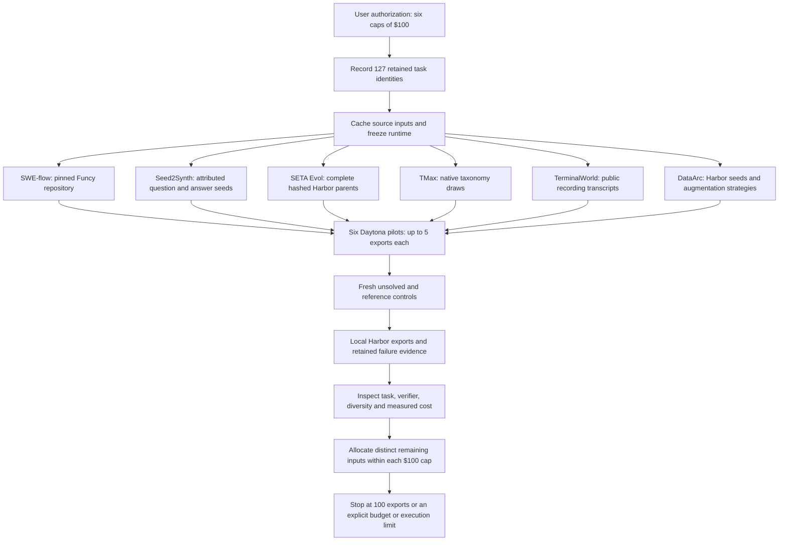

# SWE-flow, SETA and terminal expansion to 100

Authorized and launched on 14 September 2026. Each of the six listed recipes has
a separate **$100 hard cap**, for **$600 maximum additional spend**. This campaign
is separate from Wave 1 and the already funded Endless Terminals expansion.
The directory is named `owned-waves34-100`; its manifest also includes the
remaining Wave 2 recipe, SWE-flow.

## Targets and parallel expansion

| Wave | Recipe | Retained Harbor exports | New exports needed | Historical top-up estimate | Hard cap | First batch |
|---|---|---:|---:|---:|---:|---:|
| 2 | [SWE-flow](repo_reconstruct.md) | 24 | 76 | about $12 | $100 | 5 |
| 3 | [SETA Seed2Synth](terminal_synth.md) | 23 | 77 | about $79 | $100 | 5 |
| 3 | [SETA Evol](task_evolve.md) | 20 | 80 | about $48 | $100 | 5 |
| 4 | [TMax](tmax.md) | 20 | 80 | about $99 | $100 | 5 |
| 4 | [TerminalWorld](terminalworld.md) | 20 | 80 | about $63 | $100 | 5 |
| 4 | [DataArc](dataarc.md) | 20 | 80 | about $83 | $100 | 5 |

The initial objective was **473 new exports plus 127 retained tasks**, giving 100
per recipe. The user subsequently closed TMax at **55 tasks**: 20 retained and 35
new exports. The revised expansion target is **555 tasks**, with the other five
recipes still targeting 100 each. The table preserves the original allocations;
the [release inventory](releases.md) records current progress.

Historical estimates come from the [quality pilot](quality_pilot.md);
they include an allocated shared-compute proxy and are not provider invoices or
guarantees. New repositories, bounded repair attempts and source filtering can
change the actual cost. Caps are enforced independently; one recipe cannot spend
another recipe's unused allocation.

Six independent Daytona workers started at 15:54 UTC, each with four CPUs, 8 GiB
RAM and a two-hour limit. Each reserves $1.80 for estimated resource lifetime and
build allowance. The first dispatch targets **five new exports per recipe**.
After inspection, the continuous queue was started with two workers per recipe,
then expanded to three at 16:34 UTC. It allocates distinct remaining inputs, counts
in-flight targets and stops each recipe at 100 or its budget/execution boundary.
Endless Terminals runs separately.

## Sources and recipe fidelity

SWE-flow starts on Funcy at
`5419a8f8790c03ef713ab6cc23e679ad1c5ab3e4`, using the dependency profile already
executed in Wave 1. The recipe still derives development schedules from sampled
runtime traces. Further batches should use other recorded repository profiles
and exclude previously attempted schedule identities. Existing More-itertools
tasks are retained; this pilot does not regenerate them.

Seed2Synth has **280 new attributed Unix Stack Exchange question/accepted-answer
pairs**, selected across `jq`, `find`, `tar`, `awk`, `sed` and `bash`. The prior
45 seed IDs are excluded. Cached API responses, retrieval URLs, timestamps,
content licenses and question/answer author names are retained. Each batch uses
a fixed input shard; no synthetic question is presented as an original source.

SETA Evol and DataArc use disjoint five-parent pilot selections from completed
Endless Terminals batches. These are complete, text-based Harbor tasks with
matching bundle hashes. Evolution keeps its six named strategies; DataArc keeps
few-shot, self-instruct and the in-depth/in-breadth evolution directions. This
broadens the seeds beyond DataArc's earlier three examples without changing its
augmentation stages. Parent quality has not been established by independent
review; lineage is evidence of source identity, not a quality label.

TMax keeps its released legacy taxonomy, with new seeded draws across data
processing, file operations, data querying, software engineering and debugging.
The supported language selection is Python, Bash and C. It retains the separate
template, initial-test, final-test and environment-building stages.

TerminalWorld selects new recording IDs from its cached native input index at
revision `dda7c099cc076735aef28c03bf8d3624dc0564e1`. It downloads original public
metadata and plain-text recordings, respecting the acquisition adapter's bounds
and access rules. Old selected recording IDs are excluded. Only transcripts and
their source metadata feed generation; upstream task solutions and verifiers are
not supplied as recording evidence. Missing or unsupported workflows remain
filtered candidates, not invented replacements. The initial cache contains 231 usable downloads from 240 attempted recordings;
850 additional unused native recording IDs are being retrieved. Each new batch
uses a copied snapshot so a growing cache cannot change its selected inputs.

## Changes carried into the frozen runtime

The shared materialization prompt now explicitly asks for fresh execution of
reusable scripts, isolation of stale outputs, private expected values and baseline
hashes, public metric/rounding conventions and real required assets. Repairs
should address the observed failure in the same task within one initial attempt
and two repairs. TerminalWorld's separate replay/test author receives equivalent
instructions appropriate to its own stages.

SWE-flow's specification author now receives the generated public docstrings
alongside complete scheduled functions and test evidence, including parametrization
decorators, so it can reconcile scope, parameter defaults, edge cases and ordering. Its worker honors excluded schedule IDs before executing more
contrast checks. Regression tests check that the specification receives the exact
docstrings used in the skeleton and that an excluded schedule does not consume
the next candidate's execution slot.

The initial pilot runtime SHA-256 was
`e203906912d2ba282732b699f6f8ac463335cc23ee3e880236c0ddec073e5766`.
39 focused tests passed across the relevant recipes, contracts, metering and read
retries; targeted lint checks passed. These are software checks, not evidence
that the new prompts eliminate the earlier semantic verifier defects. Prompt
references preserve the full request assembly and generated requests remain in
each run's receipts.

Later scale batches carry their own pinned runtime hash. Revision `repair03`
(`5b3f7e1d6f5eeaeb7228fb2db9969290d8817f4354151bfe758521193be7e46b`)
fixes Git ownership checks: terminal images transfer the workspace to the learner,
while Harbor executes the verifier as root. Git therefore rejected repositories
created by the image with `detected dubious ownership`, repeatedly failing valid
initial-state tests. The exporter now records only the image-created repository
paths as Git safe directories before execution. It does not trust arbitrary new
learner-created paths or use a global wildcard. A
[Daytona regression check](evidence/terminal-git-ownership-check.json) reproduced
the old failure, passed with the fix, and confirmed that a new path stays untrusted.

The same revision asks the compact draft reviewer for a short summary and exact
short quotations, reducing schema-correction calls. It explicitly forbids repairing
packaging by baking reference solutions into the learner image. Existing jobs retain
their original runtimes; only future allocations use this revision.

## Evidence, quality labels and economics

The ignored `workspace/owned-waves34-100/` directory contains authorization,
cached sources, frozen runtime and six `campaigns/<recipe>/` directories. Each
recipe has its own ledger, immutable retained manifest, configs, controller
receipt, worker receipts, run events, model usage and generated tasks. No source
repository, generated program or Docker image executes on the local machine.
The user subsequently authorized Hub dataset publication under HuggingEnvs and
one consolidated implementation/documentation PR. Generation artifacts remain local
until an explicit selection passes the [release checks](dataset_release.md).

An export requires the recipe's generation checks and a fresh Harbor baseline 0
and reference 1. Its `quality_status` remains `exported`. The next pilot inspection
checks instructions, required assets, main verifier behavior and provenance.
Independent semantic review, adversarial probes and blind solver rollouts remain
separate. Preserve unsuccessful candidates and their diagnostics; do not count
them as exports or silently rewrite retained tasks.

The $600 parent reserves $100 for each recipe child. These are the same funds,
not costs to add together. Pilot completion stops workers and reconciles their
estimated lifetime, but leaves each recipe's parent allocation held for future
batches. The allocation settles only when that recipe's expansion is concluded.
Measure model calls, failed attempts, worker lifetime, new exports and retained
exports separately. Report per-export cost only against newly generated exports,
and label estimated compute separately from invoiced charges.

The [per-recipe economics snapshot](economics/waves34/README.md) separates model
charges, accounted worker estimates, reservations and available budget. Refresh
it with `scripts/report_owned_expansion.py` from the recorded local ledgers.

An initial read-only inspection already found a TerminalWorld verifier gap: its
first module-import task checks the requested script through source keywords and
a saved result, without invoking that script. The exported task remains unchanged
and is flagged for verifier review in `reports/pilot-inspection-01.json`. This is
evidence that the prompt adjustment alone does not establish semantic correctness;
the owned runtime now supports a compact, cited pre-execution consistency review.
It distinguishes reusable-program deliverables from file-only tasks and routes
concrete defects back to the bounded materialization loop. Earlier flagged exports
retain their diagnostics until a repaired revision is selected.

## Repair runtime and source isolation

The first scale runtime was `558fca718afa152b9a862b0eb34fb71ecd4735d528da49c76e5020c1ced7e85e`.
It added completed-response correction, compact review, seed exclusion, and full
SWE-flow authoring context. The next runtime,
`9bc1c3e1dcc50d9805be7cff6b3cf60be9d62b58e639e9ef07efe79c3843e427`,
clarifies that a missing execution check for a requested working program is a
blocking verifier defect. Existing jobs keep their original runtime; no paid
requests are replayed during controller adoption. Recording source snapshots fix
a race observed in the first two scale jobs; their attempted inputs remain recorded.

The queue uses immutable config/runtime hashes and separate worker receipts. Failed
candidates remain available for diagnosis; an exhausted batch releases its unused
count allocation and the queue selects fresh inputs. A provider timeout keeps its
uncertain model reservation while other independent inputs can continue.
