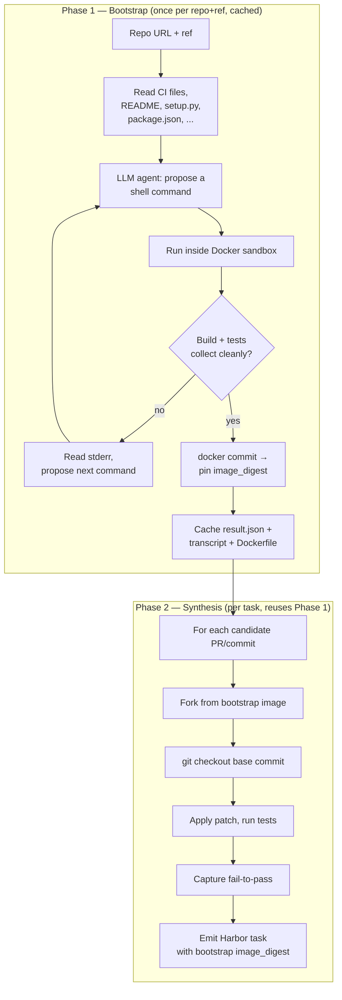

# Environment Bootstrap

## What is bootstrapping?

Everything here is **local-first**. Bootstrap runs against your machine's Docker daemon, and the tasks it emits also run locally by default (`harbor run -a oracle -p ./task`). The same task directory is portable to cloud sandboxes (E2B / Modal / Daytona / Runloop) when you opt in via `harbor run --env <name>` — but you never have to leave your laptop to use any of this.

To turn a GitHub repo into a verifiable RL task, you need a **Docker image where that repo builds cleanly and its test suite runs**. That image is what the synthesized tasks check out into, apply patches against, and verify with `pytest` / `go test` / `cargo test` / etc.

Different repos have wildly different setup needs:

- Python projects use uv / poetry / pip / conda + system libs (`gcc`, `libpq`, ...)
- JS/TS projects use pnpm / yarn / npm / bun, sometimes inside monorepos
- Go projects use modules + occasional build tags + CGO toolchains
- Rust projects pin specific toolchain versions
- Java projects use Maven or Gradle + a specific JDK
- C/C++ projects use CMake / Make / Bazel / Meson + system deps

Hand-writing a Dockerfile per repo is unworkable when the goal is "any repo." So the **bootstrap phase** does it for you: an LLM agent reads the repo, runs shell commands inside a sandboxed container, iterates until the build + tests succeed, then commits the result as a Docker image. The image is cached locally and reused for every subsequent task generated from that repo.

You only need bootstrap for pipelines that actually run code (`pr_runtime`, `commit_runtime`, `cve_patches`, `mutation_bugs`, `code_instruct`, `equivalence_tests`, `refactor_synthesis`). The text-only `pr_diff` pipeline skips it entirely.

### Supported languages

The bootstrap agent has built-in presets for these languages — base images, install hints, sanity checks, and known pitfalls are injected into the system prompt automatically:

| Language | Base image | Detected from |
|---|---|---|
| Python | `python:3.12-slim` | `pyproject.toml`, `setup.py`, `setup.cfg`, `requirements.txt` |
| Node / TypeScript | `node:22-slim` | `package.json`, `tsconfig.json`, `pnpm-lock.yaml`, `yarn.lock` |
| Go | `golang:1.23` | `go.mod` |
| Rust | `rust:1-slim` | `Cargo.toml` |
| Java / Kotlin / Scala | `eclipse-temurin:21-jdk` | `pom.xml`, `build.gradle`, `build.gradle.kts` |
| C / C++ | `ubuntu:24.04` | `CMakeLists.txt`, `configure.ac`, `Makefile`, `meson.build` |

Other languages still work, they just don't get language-specific hints — the agent falls back to a generic Ubuntu base image and figures it out from `README.md` + repo files.

Override the auto-detected language with `--language <name>` or `--base-image <image>` if you need a specific toolchain (e.g. Python 3.11 instead of 3.12, or a CUDA-enabled base).

### Pipeline ↔ language compatibility

Some pipelines work on any language (they operate on diffs, PRs, commits); others are restricted to Python because they parse Python AST or emit pytest verifiers.

| Pipeline | Languages |
|---|---|
| `pr_diff`, `pr_runtime`, `pr_stream`, `commit_runtime`, `cve_patches` | any |
| `mutation_bugs`, `code_instruct`, `equivalence_tests`, `refactor_synthesis` | Python only |

The CLI runs a pre-flight check: if you point a Python-only pipeline at a non-Python repo, generation aborts before bootstrap even starts so you don't burn 5+ minutes finding out. Pass `--force-language` to skip the check and proceed anyway (the pipeline will likely emit zero tasks; explicit user choice).

## Choosing an LLM

The bootstrap agent works with any LLM that LiteLLM supports. In practice:

- A strong **code-focused** model (e.g. a recent Qwen-Coder via Hugging Face Inference Providers) handles clean libraries and CLI tools at the lowest cost.
- A strong **general-purpose** model (e.g. a recent Claude Sonnet) handles moderately complex repos — compiled extensions, monorepos, non-trivial build systems.
- A **flagship reasoning** model (e.g. Claude Opus or a frontier GPT) helps with full-stack apps or repos with unusual toolchain choices where the agent needs to debug across multiple layers.

You don't have to pick perfectly. A weaker model will iterate more turns; a stronger model will finish faster but cost more per turn. The cost cap (below) bounds the worst case either way.

The `--llm` flag accepts a LiteLLM-format string. Some examples:

| Provider | `--llm` value |
|---|---|
| Anthropic | `anthropic/<model-name>` |
| OpenAI | `openai/<model-name>` |
| Hugging Face Inference Providers | `huggingface/<repo>:<provider>` (e.g. `huggingface/<org>/<model>:together`) |
| Self-hosted vLLM / Ollama | `openai/<your-model>` with `--llm-endpoint http://...` |

Anything LiteLLM supports works, including Bedrock, Vertex, Mistral, and others.

### API keys

Set the provider's default environment variable; the CLI picks it up automatically.

| Provider | Env var |
|---|---|
| Anthropic | `ANTHROPIC_API_KEY` |
| OpenAI | `OPENAI_API_KEY` |
| Hugging Face | `HF_TOKEN` |
| Other | override via `--llm-key-env` or YAML config |

### Cost guardrail

Every bootstrap run is bounded by `max_llm_spend_usd` (default `$5.0`). When the running cost reaches the cap, the agent loop aborts cleanly. Set lower for tighter control:

```bash
repo2rlenv generate ... --bootstrap-opt max_llm_spend_usd=1.0
```

### Provider fallback

When the primary LLM returns a 5xx, rate-limit, network, or timeout error, the agent loop automatically retries with `--llm-fallback`. 4xx errors (wrong model id, auth) are NOT retried — those are config bugs you want to see immediately.

```bash
repo2rlenv generate \
  --repo <owner>/<repo> --pipeline pr_runtime \
  --llm "anthropic/<sonnet-model>" \
  --llm-fallback "openai/<gpt-model>" \
  --out ./datasets/<name>
```

Fallback chains are capped at 3 levels deep so misconfigured loops don't run forever.

## CLI cheatsheet — switching LLMs

The `--llm` flag drives both the bootstrap phase AND any LLM-synthesized pipeline steps. Pick whichever model fits your repo + budget:

```bash
# Code-focused open model via Hugging Face Inference Providers
repo2rlenv generate \
  --repo <owner>/<repo> \
  --pipeline pr_runtime --pipeline-opt limit=10 \
  --llm "huggingface/<org>/<model>:<provider>" \
  --out ./datasets/<name>

# Claude Sonnet (general-purpose)
repo2rlenv generate \
  --repo <owner>/<repo> \
  --pipeline pr_runtime --pipeline-opt limit=10 \
  --llm "anthropic/<sonnet-model>" \
  --out ./datasets/<name>

# Claude Opus / frontier OpenAI for hard apps; raise the cost cap
repo2rlenv generate \
  --repo <owner>/<repo> \
  --pipeline pr_runtime --pipeline-opt limit=10 \
  --llm "anthropic/<opus-model>" \
  --bootstrap-opt max_llm_spend_usd=3.0 \
  --out ./datasets/<name>

# Self-hosted vLLM or Ollama (OpenAI-compatible endpoint)
repo2rlenv generate \
  --repo <owner>/<repo> \
  --pipeline pr_runtime --pipeline-opt limit=10 \
  --llm "openai/<your-model>" \
  --llm-endpoint http://your-vllm-host:8000/v1 \
  --out ./datasets/<name>
```

### Bootstrap-only (no synthesis)

To build + cache the image without running a pipeline:

```bash
repo2rlenv bootstrap \
  --repo <owner>/<repo> \
  --ref main \
  --llm "anthropic/<sonnet-model>" \
  --max-iterations 25 \
  --max-spend-usd 2.0 \
  --image-registry ghcr.io/<your-org>/<repo>-r2e \
  --out ./envs/<repo>/
```

### Forcing a cache miss

A previously-cached image is reused on later runs. To force the agent to re-run from scratch (e.g. after a base-image upgrade):

```bash
repo2rlenv generate ... --force-bootstrap
```

### Self-supplied Dockerfile (bypass the agent)

For tightly-controlled environments, skip the LLM iteration entirely and build a Dockerfile you wrote:

```bash
repo2rlenv generate \
  --repo <owner>/<repo> \
  --pipeline pr_runtime \
  --bootstrap-opt user_dockerfile=./my-Dockerfile \
  --out ./datasets/<name>
```

The agent loop is skipped; we just build your Dockerfile, commit the result, and use it as the bootstrap image.

## How bootstrap works internally

Bootstrap is a separate phase, run **once per `(repo, commit)` and cached**. Inline iteration inside the per-task synthesis loop would be wasteful and slow.



You pay the LLM agent cost **once** per `(repo, commit)`; every later task generated from that repo reuses the cached image for free.

The agent is implemented as a ReAct-style Thought / Action / Input loop with tools for shell execution, file reading, and a structured `SAVE_SETUP` call that ends the session by recording the rebuild + test commands the rest of the system uses. Per-language hints (Python / Node / Go / Rust / Java / C-C++) get injected into the agent's system prompt so it doesn't have to rediscover ecosystem conventions on every run.

## Cache strategy

Bootstrap is expensive (multi-minute, real LLM cost). Reuse aggressively.

The cache key is `(repo, commit, base_image, languages_hint)`. Anything that would produce a different image goes into the key; iteration limits and budget caps don't (they bound the build, not the result).

A successful bootstrap writes to `./envs/<owner>__<name>/<short_commit>/`:

```
./envs/<owner>__<name>/<short_commit>/
├── result.json            # image_digest, image_tag, rebuild_cmds, test_cmds, ...
├── transcript.jsonl       # full agent transcript (for debugging)
└── (Dockerfile generated from the transcript, for reproducibility)
```

Subsequent calls against the same `(repo, commit)` hit this cache and skip the agent entirely. If you push the image to a registry via `--image-registry`, the cache directory is enough for collaborators to pull and reuse — they don't need to re-run bootstrap.

## When bootstrap fires

There are two invocation patterns:

1. **Implicit (the default)** — `repo2rlenv generate` notices the pipeline needs a sandbox image and triggers `ensure_bootstrap()` itself. Subsequent runs hit the cache and skip the agent. This is the path the CLI examples above use.

2. **Explicit** — call `repo2rlenv bootstrap ...` to pre-warm an image without running synthesis, or to debug a repeatedly-failing build. The cached image is then picked up by any later `generate` call against the same repo+ref.

Use the explicit form when:
- Debugging a build that fails repeatedly (full transcript at `./envs/<repo>/<sha>/transcript.jsonl`)
- Pre-warming an image for many subsequent generation runs
- Sharing a working image with collaborators (push the env dir + image_digest)

## Configuring bootstrap

The bootstrap phase is driven by `BootstrapSpec`. The fields you'll touch most often:

| Field | What it does |
|---|---|
| `enabled` | Toggle the whole phase. Set to `False` if you supply a pre-built image elsewhere. |
| `max_iterations` | Cap on agent turns (default 20, raise for large repos). |
| `max_seconds` | Wall-clock cap (default 1800s). |
| `max_llm_spend_usd` | Hard cost cap (default $5.0). Loop aborts cleanly when crossed. |
| `base_image` | Override the auto-detected Docker base image. |
| `user_dockerfile` | Path to a Dockerfile that bypasses the agent entirely. |
| `cache_dir` | Where to store cached results (default `./envs/`). |
| `image_registry` | If set, push the built image here so collaborators can pull it. |
| `languages_hint` | Override language auto-detection (e.g. `["python", "rust"]`). |

You can set any of these on the CLI via `--bootstrap-opt key=value` (repeatable) or in YAML config:

```bash
# Point at a different cache directory (e.g. reuse a teammate's pre-built images)
repo2rlenv generate ... \
  --bootstrap-opt cache_dir=./envs-shared \
  --bootstrap-opt max_iterations=30 \
  --bootstrap-opt max_seconds=2400
```

The flag accepts any field on `BootstrapSpec`. Booleans, numbers, and JSON values are coerced automatically.

## What ships in each generated task

Every task built by a sandbox-required pipeline carries the bootstrap provenance in its `task.toml`:

```toml
[metadata.repo2env.bootstrap]
image_digest = "ghcr.io/<your-org>/<repo>-r2e/bootstrap@sha256:..."
bootstrap_commit = "a1b2c3d..."
llm = "anthropic/<model-name>"
iterations = 3
build_time_sec = 247
```

That's enough for a consumer to rebuild the environment from scratch — the agent's full transcript is stored in the cache directory and the reconstructed Dockerfile lives alongside the image digest.

## Edge cases to know about

### Bootstrap fails after `max_iterations`

The agent couldn't make the repo build within budget. You'll see `BootstrapError` with the last few lines of stderr and a pointer to the transcript. Common next steps:

- Raise `max_iterations` / `max_llm_spend_usd` and retry.
- Use a stronger LLM (see [Choosing an LLM](#choosing-an-llm)).
- Hand the agent a working Dockerfile via `--bootstrap-opt user_dockerfile=./my-Dockerfile`.

### Repo requires docker-compose (Postgres / Redis / a web service)

Bootstrap currently produces a single image. Multi-container apps need a docker-compose setup, which isn't yet supported — for now, supply a `user_dockerfile` that includes the auxiliary services, or pin to a Harbor backend that supports compose (e.g. Daytona).

### Repo requires GPU at build time

Some ML kernels (e.g. CUDA extensions) can't build on a CPU sandbox. Run on a GPU-enabled Harbor backend (Modal A100 / H100) — the bootstrap inherits GPU access from `SandboxSpec.gpu`.

### PR introduces a new dependency

Each pipeline that generates per-PR tasks defaults to **re-installing dependencies after `git checkout`**. So an additive dep introduced by a PR is captured automatically; you don't need to re-bootstrap. If a PR replaces the build system entirely, you'll want a fresh bootstrap for that commit — pass `--force-bootstrap`.

### Stale cached image

A bootstrap from months ago may use outdated base images. Re-run with `--force-bootstrap` to regenerate.

### Cost overrun

The `max_llm_spend_usd` cap aborts the agent loop the moment the running total crosses the threshold. No quiet runaway costs.

## Architecture-mode pointers (for contributors)

- The bootstrap agent + sandbox primitives live under `src/repo2rlenv/bootstrap/`. Entry point: `ensure_bootstrap(repo, spec, llm)`.
- The agent loop is a ReAct-style Thought / Action / Input parser; tools are `BASH`, `READ_FILE`, `LIST_DIR`, `SAVE_SETUP`, `GIVE_UP`.
- Per-language hints live in `bootstrap/presets.py` and get injected into the agent's system prompt — that's where to add new languages or fix common mistakes the agent makes for a given ecosystem.
- See [`CONTRIBUTING.md`](../../CONTRIBUTING.md) for how to add tests + the lint/format flow.

## See also

- [SPEC.md](./SPEC.md) — input/output contract
- [pipelines/](../pipelines/) — per-pipeline docs
- [SWE-bench-Live paper](https://arxiv.org/abs/2505.23419) — broader context for live, automated dataset curation
