# CodeMidas — release preparation

**Unreleased.** [PR #165](https://github.com/huggingface/Repo2RLEnv/pull/165)
adds CodeMidas as an experimental recipe. The package remains **0.9.1**.
Merge review comes first; a version, tag and package release will be prepared
separately after merge. The 100-task dataset is staged locally, not published.

## What changes

CodeMidas turns working source code into a coding task: identify public behavior,
remove its implementation, write an instruction and private tests, then restore
the original implementation as the oracle. It needs no PR or issue.

| Surface | Name or entry point |
|---|---|
| Pipeline family | `repo_reconstruct` |
| Recipe | `codemidas` |
| Generation | `repo2rlenv generate --pipeline repo_reconstruct --recipe codemidas --config CONFIG` |
| Audit | `repo2rlenv codemidas audit --help` |
| Recipe code | `src/repo2rlenv/pipelines/recipes/codemidas/` |
| Runnable configuration | `examples/owned-codemidas.yaml` |
| Design and full prompts | [Pipeline guide](../pipelines/codemidas.md), [RFC 0031](../rfcs/0031-codemidas-recipe.md), [prompt reference](../pipelines/prompts/codemidas.md) |

The implementation and prompts are owned by Repo2RLEnv. No upstream research
package is installed. Construction and review use GPT-6 Luna/Sol; the campaign
used Daytona CPU workers. Task rewards come from deterministic tests.

```mermaid
flowchart LR
  A["Pinned GitHub source<br/>or inline Stack v3 row"] --> B["Remote bootstrap<br/>and source exploration"]
  B --> C["Behavioral contract<br/>and missing implementation"]
  C --> D["Execute reference probes<br/>write and review private tests"]
  D --> E["2 baseline failures<br/>4 oracle successes"]
  E --> F["4 Luna attempts<br/>independent Sol review"]
  F --> G["4 Sol screens<br/>record difficulty outcomes"]
  G --> H["100 local Harbor tasks<br/>adversarial stage blocked"]
  H --> I["PR review and merge"]
  I --> J["Separate package release<br/>and Hub publication steps"]
```

## Dataset and oracle evidence

The campaign attempted **213 constructions**, exported **128** tasks, and reviewed
all 128. **101** passed ordinary solver review; **26** had demonstrated verifier or
instruction defects and **one** remained unresolved. Exactly **100** were curated.
The construction count includes two candidates stopped after reaching the goal.

For the selected set, all **400 oracle executions passed** and all **200 baseline
executions failed**, on fresh remote environments. The oracle restores original
source at the recorded repository revision. These checks establish reproducible
fail-to-pass behavior in the campaign; they do not prove verifier completeness.
The archive's task identities, file hashes and executable modes were checked.

Sol screening produced **90 all-pass, 4 mixed and 6 all-fail tasks**. Sol succeeded
on 370/400 attempts and on at least one attempt for 94/100 tasks. Luna succeeded
on 358/400 attempts and on at least one attempt for 92/100 tasks. Most tasks are
easy for Sol. Only four meet the mixed-outcome screening filter; **none has full
method acceptance**, because adversarial checks remain provider-blocked.

Every selected `task.toml` retains `status = "blocked"`, the passing ordinary-review
reason code and its evidence binding. No generic `verified` label or training-gain
claim has been added. All-pass and all-fail artifacts remain useful to inspect,
but their suitability depends on the intended learner and training setup.

The source panel has ten repositories, **98 GitHub-source tasks and two actual
inline Stack v3 tasks**. The Stack tasks use GlobalFishingWatch/ShipDataProcess
from a pinned `HuggingFaceCode/stack-v3-train` row; they are not GitHub tasks merely
relabeled as Stack. See the [repository counts](../pipelines/codemidas.md#measured-local-campaign).
There are 17 multi-symbol tasks and no multi-file tasks; scope is Python/CPU.

## Economics

| Scope | Amount |
|---|---:|
| Recorded API usage | $88.20 |
| Conservative Daytona compute estimate | $11.71 |
| Combined accounted | **$99.91** |
| Unknown API billing reserved | $1.47 |
| Whole-campaign cost per curated task | **$1.00** |
| Authorized cap | $300 |

This includes failed attempts, earlier pilots, construction, review and screening;
it excludes interactive assistant usage. Compute is not an invoice. All campaign
workers are stopped. Six uncertain API outcomes from a connectivity interruption
remain reserved, bringing the upper accounted-plus-reserved amount to $101.38.
[Detailed stage costs](../pipelines/codemidas.md#measured-economics) and the
[portable metrics snapshot](../data/pipelines.json) preserve these scopes.

## Audit findings and fixes

| Area | Finding and disposition |
|---|---|
| Oracle and task identity | Rechecked all 600 selected control receipts against their recorded hashes; every reference pass and baseline failure matched. |
| Review labels | Inconclusive or infrastructure-limited reviews previously fell through to `needs_repair`. They now remain blocked/incomplete. Demonstrated verifier errors and confirmed exploits still require repair. The selected 100 are unaffected. |
| Adversarial evidence | A blocked or failed probe cannot substantiate a confirmed exploit. Such a reviewer claim is rejected before acceptance. No blocked request was retried. |
| Portable evidence | Release plans can include explicit JSON evidence documents. Staging places them outside executable bundles and hashes them in the manifest. No implicit traversal of local evidence paths occurs. |
| Stack source notice | The inline row omitted the original license file. The publication candidate includes its complete Apache-2.0 text, retrieved from the same pinned upstream commit, as supplementary source evidence. Task code remains sourced from Stack. |
| Other source notices | Bundled upstream license files remain intact for the other nine repositories. The collection retains mixed source licenses; it is not relicensed as a single original work. |
| Isolation and recovery | Tests cover private artifacts, bounded tool arguments, runtime installation and evidence-bound recovery. Learner credentials and public network access remain unavailable; model requests run in the controller. |
| Repository hygiene | Data, checkpoints, runtime wheels and provider logs remain ignored. The PR contains implementation, tests, prompts, public summaries and docs. |

Regression tests cover incomplete versus defective labels, impossible exploit
claims, evidence path traversal/collisions, evidence tampering and unchanged task
bytes during release staging. CI also covers existing pipelines, Windows wheel
startup, source/wheel builds, generated docs and strict MkDocs rendering.

## Publication package

The prepared local candidate contains the same 100 task bundles and matching
archive contents, plus **100 portable validation summaries** and two supplementary source-license
documents. `manifest.json` links and hashes those documents. Summaries preserve
control outcomes, original receipt digests, ordinary-review judgments, screening
rewards, source identity and the blocked stage. Raw model requests, credentials,
worker receipts and full trajectories are excluded.

Original task annotations retain historical controller paths as provenance.
Readers should use `manifest.json` → `evidence_documents` for portable summaries.
A summary is not the complete original trace; publishing it does not make the
independent model review a mathematical correctness proof.

The first local staging is preserved. Publication preparation creates a new
immutable staging directory and verifies that **all task bytes and executable
identities are unchanged**. Nothing has been uploaded to the proposed
`HuggingEnvs/Repo2rlenv-codemidas` destination. The existing published-task totals
therefore remain unchanged.

## After merge

1. Select the package version and record the merge commit; finish the unreleased
   history entry, versioned examples and lock metadata together. This PR does not
   reserve a version number.
2. Build the release from that commit and require all CI and Windows wheel gates.
   Creating a GitHub Release or dispatching the release workflow can publish to
   PyPI; neither action is part of this PR.
3. Prepare the final Hub card with the actual publication status, verify the new
   immutable staging, then publish through the receipt-backed release command.
   Pin its registry to the confirmed upload commit and add it to the collection.
4. Update the dataset inventory only after upload completeness is checked. Keep
   adversarial-blocked labels and the measured difficulty breakdown visible.

See [dataset publication](../pipelines/dataset_release.md) for staging and upload
contracts. Fresh oracle/solver checks are needed if executable task contents change;
adding external summaries alone does not establish or invalidate new execution results.

## Credit and remaining limits

Inspired by Bowen Ye and collaborators' [CodeMidas paper](https://arxiv.org/abs/2609.22068).
This is an independent implementation of its source-driven construction and
filtering method, with explicit Sol/Luna, Python and cloud-runtime choices.
It does not reproduce the full multi-language corpus or downstream RL training.
Public-source contamination has not been ruled out. Dependency constraints and
base-image tags are not a permanently archived, fully locked rebuild closure.
The [reproduction boundary](../pipelines/codemidas.md#reproduction-boundary) remains
part of the release contract.
