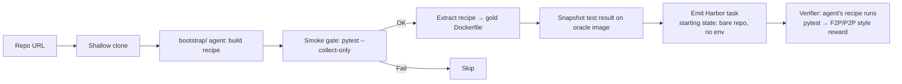

# RFC 0008: `env_setup`

**Status:** draft
**Author:** `@adithya-s-k`
**Created:** 2026-07-22
**Implemented by:** _(pending)_
**Reference dataset:** _(pending — target `AdithyaSK/repo2rlenv-env-setup`)_

## Summary

Take a bare, un-bootstrapped repo and hand the agent the RL task of *making the test suite build and run green from scratch*. The pipeline emits a Harbor task whose starting state is `git clone <repo>` at some `base_commit`, no Dockerfile, no dependencies installed. The reward is the fraction of the repo's own tests that pass under whatever install recipe the agent produces. **The pipeline turns our existing `bootstrap/` machinery — which today is a build-time step consumed by every sandboxed pipeline — into a first-class training and eval target.**

## Motivation

Every sandbox-verified pipeline we ship today (`pr_runtime`, `commit_runtime`, `cve_patches`, `code_instruct`, `equivalence_tests`) leans on `bootstrap/` to produce a per-repo Docker image where the test suite runs. Bootstrap itself is an agent — an LLM iterates commands (`apt install`, `uv pip install -e ".[test]"`, `pytest --collect-only`) until the smoke gate passes. That agent-with-shell loop is *itself* a great RL environment: (1) it's model-agnostic — any coding agent can drive it; (2) it's naturally verifiable via `pytest` exit code; (3) the goal is unambiguous — "make `pytest` pass"; (4) it stresses tool-use fluency more than pure code generation, which is the current weak point in most agents.

Three papers converge on this task shape (and none of them is quite what we want to ship):

- **Repo2Run** (arXiv:2502.13681) — the closest prior work. Takes a Python repo with no Dockerfile and produces a runnable image. Uses an agent + rollback stack + pytest verification. Their eval dataset is small (~100 repos), Python-only, and they don't publish the environment for training.
- **SetupBench** (arXiv:2507.09063) — benchmarks 43 tasks across languages (Python, JS, Rust, Java, Go) for repo-setup capability. Their scoring is "did the reference command succeed?" — not the graded partial-credit signal we want.
- **EnvBench** (arXiv:2503.14443) — 329 repos across languages, scoring by a language-specific "canonical smoke test". Similar limitation: pass/fail, not graded.

None of them ships the pipeline for training loops. Our `bootstrap/` layer *already does the hard work* (docker sandbox primitives, language auto-detect, LLM-driven iteration, cost tracking) — this RFC exposes that machinery as a `repo2rlenv generate` pipeline instead of a build step, gives it a graded reward, and publishes a reference dataset.

### The anti-argument

*"Isn't this the same thing as our existing `bootstrap/` step? Why is it a pipeline?"* The `bootstrap/` step is a **build-time producer** — it consumes an unbuilt repo and produces a cached Docker image the other pipelines then start from. It hides its work from the agent that eventually solves the downstream task. `env_setup` is the **runtime consumer** — the agent-under-eval receives the un-bootstrapped repo and *does* the bootstrap work. Same primitives, opposite direction. And it needs its own emitter, its own verifier, and its own reference dataset.

*"Isn't this an eval, not a training env?"* It's both. As an eval it's a very direct capability probe. As a training env it exposes a domain (build-system fluency, package-manager idioms, dependency conflict resolution) that current agents are notably weak on and where explicit reward signal is scarce.

## Design

### Input

- **Source** — GitHub · GitLab · local. Any repo we can shallow-clone.
- **Trigger** — `repo2rlenv generate --pipeline env_setup --repo <owner/name> --pipeline-opt limit=50 --llm anthropic/claude-sonnet-4-6 ...`.
- **Options model** — `EnvSetupOptions`:
  - `limit: int = 20` — number of `(repo, ref)` tuples to emit.
  - `refs: list[str] | None = None` — specific commits/tags to base tasks on; default is HEAD only.
  - `language_hint: str | None = None` — override language auto-detection.
  - `min_tests_collected: int = 5` — reject repos whose test suite collects fewer than N tests when the oracle solution is applied (safety against uninformative rewards).
  - `max_setup_time_sec: int = 1800` — per-task agent budget (matches Harbor's default agent-timeout envelope).
  - `use_oracle_recipe: bool = True` — bake the *bootstrap-produced* recipe as the gold patch. If `False`, the emitted task has no oracle (eval-only).

### Algorithm

1. Clone the repo at `base_commit` (default HEAD).
2. Run our existing `bootstrap/` agent to produce a working Dockerfile + test invocation, exactly as we do for `pr_runtime` today. Cache the result.
3. Take a snapshot of `pytest`'s output on the bootstrap image — this becomes the **target test result** the agent's environment must match.
4. Emit a Harbor task whose starting state is a **bare** repo checkout (no Dockerfile, no installed deps), the agent's job description ("make `pytest` pass"), and a baked verifier that runs the agent's Dockerfile against `pytest` and grades against the target snapshot.
5. The gold patch adds the bootstrap-produced Dockerfile + shell-command manifest. Oracle scores 1.0 by construction.

### Output

- **Task shape** — standard Harbor tree:
  - `task.toml` with `[metadata.repo2env]` carrying `pipeline=env_setup`, `pipeline_version`, `repo`, `ref`, `reward_kinds=["test_execution","graded"]`, `env_setup.target_tests: list[str]` (the F2P set).
  - `environment/Dockerfile` — **minimal base image** (`python:3.12-slim` / `node:20-slim` / `rust:1-slim`, chosen from language auto-detect). Agent overwrites this with their own recipe.
  - `tests/verifier.py` — reuses `_pr_runtime_verifier.py`, seeded with the target test set as F2P.
  - `tests/f2p.json`, `tests/p2p.json` — the target test names + statuses from step 3.
  - `solution/patch.diff` — creates the bootstrap-produced Dockerfile + install-script + any patched pyproject entries.
  - `instruction.md` — "make `pytest` pass in `/workspace`. The repo is at `<repo>@<base_commit>`. No env is set up. Write `environment/Dockerfile` + any install script; when Harbor rebuilds and runs `pytest`, all tests should pass. You may install any packages the repo needs."
- **`[metadata.repo2env]` provenance** — same shared fields plus `env_setup.language`, `env_setup.oracle_dockerfile_lines`, `env_setup.oracle_test_time_sec`.

## Verification

- **Reward kind(s)** — `test_execution` + `graded`. Reuses `_pr_runtime_verifier.py` unchanged: F2P = the tests the oracle image runs green; P2P is empty (there's no "existing passing set to protect" — the agent has to make everything green from scratch).
- **Reward formula** — `reward = f2p_rate` (fraction of target tests passing under the agent's Dockerfile). Binary-strict `resolved` uses SWE-bench semantics (`all f2p pass`).
- **Oracle invariant** — the bootstrap-produced Dockerfile + shell-script MUST score 1.0 at emit time. Enforce via the same `harbor run -a oracle` gate we use for `pr_runtime`.
- **Non-tamper** — verifier applies the agent's `environment/Dockerfile` to the same minimal base image + runs `pytest` via a fixed test command derived from step 2. Agent can't edit the verifier (baked in `tests/`); the test suite in `/workspace` is the repo's own suite, not the LLM's.

## Anti-contamination

- **How does the fix leak in?** The repo's `README` / `CONTRIBUTING.md` / `.github/workflows/ci.yml` typically contains the install commands verbatim. The agent will (rightly) find and use them. That's a feature, not a bug — the task explicitly permits reading the repo. What we *don't* want:
  - Docker Hub / GitHub Container Registry serving a pre-built image for the repo under the same tag (agent could just `FROM <registry>/<repo>:<tag>` and inherit the answer). Handle by resolving `FROM` lines to well-known base images (rejecting unknown registries in the verifier).
  - Package manager caches (e.g. a wheelhouse) already containing the pinned versions the recipe expects. Not a real leak — package installs are the whole point.
- **Guards** — `_env_guard.py`'s **git-history scrub** is off by default here (the repo's own commit history and workflow files are legitimate solve-context). **Egress guard** is off — the agent NEEDS `pip install` / `apt install` / `cargo build` to reach the network.
- **The principle**: the environment enforces recipe validity (does the Dockerfile build? does pytest collect the target tests?); the prompt never tells the agent what versions to pin.

## LLM use

- **`at bootstrap` (cached)** — one call to `bootstrap/` per `(repo, ref)` to produce the oracle recipe. Amortized: 5-15 min agent-time on first pass, cache-hit on subsequent generations for the same tuple. Cost ~$0.30-$2.00 per repo.
- **`at synthesis`** — **no per-task LLM call**. The instruction is a template. This is the cheapest pipeline in the set at emit time.
- **`at verify`** — no LLM. Verifier is pure stdlib.

For a 100-env dataset across ~30 repos, budget: 30 × ~$1 = **~$30** in bootstrap LLM spend, one-time.

## Yield & repo suitability

- **Expected yield** — high. Any repo where `bootstrap/` today produces a working image is a candidate. That's already most Python / Node / Go / Rust libs we've tested. Reject repos whose test suite is empty (`min_tests_collected` gate).
- **What repos work?** — CPU-only test suites, no exotic system deps (nvidia toolchain, kernel modules). Python / JS / Go / Rust — polyglot from day one, unlike `code_instruct` / `equivalence_tests`.
- **What repos don't work?** — Repos whose tests need GPUs, external services (a live database, a paid API), or system-level setup outside a container (kernel modules, systemd, sudo).
- **How much history?** — one env per `(repo, ref)` pair. If we want more envs from one repo, we can bake tasks at multiple refs (a release tag, HEAD~10, HEAD). The reward changes as the deps drift.

## Dependencies

- **Reused pipeline machinery** — `bootstrap/` (the whole subsystem — that's the point), `_pr_runtime_verifier.py` (F2P/P2P grading), `_eval_script.build_binary_eval_script` (for the fallback exit-code path), `_env_guard.py` (partially — see anti-contam section).
- **New external deps** — none. Everything is stdlib + existing internals.

## Alternatives considered

- **Bake the oracle Dockerfile into the emitted task from the start, agent edits it.** Rejected: the whole point is that the agent starts with *nothing*. Watering that down turns it into "modify a Dockerfile" which is a much smaller task.
- **Grade on exit code of `pytest` only, not F2P set.** Rejected: too coarse. Half-solving (agent gets 40 of 50 tests to pass) should score 0.8, not 0.0.
- **Multi-language from day one vs. Python-first.** Chose multi-language: `bootstrap/` already auto-detects language, the F2P shape doesn't care what language the tests are written in, and being polyglot from v1 differentiates this from Repo2Run's Python-only scope.

## Rollout plan

1. **Smoke** — 3 envs on `pallets/click`, `psf/requests`, `python-attrs/attrs` (already in `envs/`, cheap first bootstrap). Confirm oracle scores 1.0.
2. **Scale** — 100 tasks across ~30 repos from the same utility-heavy pool `equivalence_tests` uses (`plans/archive/repo_catalog.md`). One env per repo at HEAD.
3. **Oracle gate** — every emitted env's baked Dockerfile MUST score 1.0. Drop any that don't; refresh `bootstrap/` on those.
4. **Real-agent eval** — sample 10 with claude-code + Sonnet 4.6 (via Harbor). Report solve rate vs. Repo2Run's ~55% Python baseline.
5. **Publish** — `AdithyaSK/repo2rlenv-env-setup` on the Hub, add to collection.
6. **Docs** — `docs/pipelines/env_setup.md`, findings notes in `plans/env_setup_audit_iter*.md`.
7. **Ship `experimental`**. Promote to stable after a release cycle of real use.

## Open questions

- **Do we bake the target `pytest` test names, or let the agent's Dockerfile decide what to run?** Baking gives a stable, comparable reward across attempts. Not baking exercises test-discovery. RFC leans toward baking — deterministic reward > exercise variety, and test-discovery is a secondary skill.
- **How to handle repos with lockfiles vs. non-pinned deps?** Repos with a `poetry.lock` / `uv.lock` / `package-lock.json` are much easier to solve — you can literally `uv pip sync uv.lock`. Consider tagging tasks with a `has_lockfile` bool so training regimes can rebalance.
- **Multi-language P2P?** For `pr_runtime`-shape pipelines, P2P protects against regressions. For `env_setup` there is no P2P — everything is F2P. Design keeps P2P empty; if the pattern warrants a "must-keep-passing" subset later, revisit.

## References

- Repo2Run: [arXiv:2502.13681](https://arxiv.org/abs/2502.13681) — [bytedance/Repo2Run](https://github.com/bytedance/Repo2Run) (Python-only, eval-focused)
- SetupBench: [arXiv:2507.09063](https://arxiv.org/abs/2507.09063) — [microsoft/SetupBench](https://github.com/microsoft/SetupBench) (multi-language, pass/fail scoring)
- EnvBench: [arXiv:2503.14443](https://arxiv.org/abs/2503.14443) — [JetBrains-Research/EnvBench](https://github.com/JetBrains-Research/EnvBench) (multi-language, canonical-smoke scoring)
- SWE-bench (F2P/P2P semantics we reuse): [arXiv:2310.06770](https://arxiv.org/abs/2310.06770)
- In-repo prior art: `src/repo2rlenv/bootstrap/` (agent primitives we're exposing), `src/repo2rlenv/pipelines/_pr_runtime_verifier.py` (verifier we reuse), `src/repo2rlenv/pipelines/pr_runtime.py` (F2P/P2P task shape we mirror).

## Implementation

*Filled in when the RFC status flips to `implemented`.*

| | |
|---|---|
| **Initial PR** | _(pending)_ |
| **Shipping release** | _(pending — target v0.9.0)_ |
| **Source file** | [`src/repo2rlenv/pipelines/env_setup.py`](https://github.com/huggingface/Repo2RLEnv/blob/mahttps://github.com/huggingface/Repo2RLEnv/blob/main/src/repo2rlenv/pipelines/env_setup.py) *(pending)* |
| **Options model** | [`src/repo2rlenv/spec/options.py`](https://github.com/huggingface/Repo2RLEnv/blob/mahttps://github.com/huggingface/Repo2RLEnv/blob/main/src/repo2rlenv/spec/options.py) — `EnvSetupOptions` *(pending)* |
| **Doc page** | [`docs/pipelines/env_setup.md`](../pipelines/env_setup.md) *(pending)* |
| **Findings / release notes** | _(pending)_ |
| **Reference dataset** | [`AdithyaSK/repo2rlenv-env-setup`](https://huggingface.co/datasets/AdithyaSK/repo2rlenv-env-setup) *(pending)* |
| **Follow-up PRs** | _(pending)_ |
