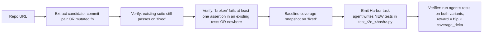

# RFC 0009: `test_synthesis`

**Status:** draft
**Author:** `@adithya-s-k`
**Created:** 2026-07-22
**Implemented by:** _(pending)_
**Reference dataset:** _(pending — target `AdithyaSK/repo2rlenv-test-synthesis`)_

## Summary

Given a repo at a known-good commit, mutate a source function (or take an intentionally-broken revert), then ask the agent to *write the failing test*. Reward = the fraction of the emitted test suite that (a) fails on the broken variant and (b) passes on the fixed variant, weighted by the incremental line coverage the new tests add. **TDD as a first-class RL task.**

## Motivation

Every pipeline we ship today asks the agent to write *code*. `code_instruct` (write a function to pass a test), `equivalence_tests` (write a function equivalent to a reference), `pr_runtime` / `commit_runtime` / `cve_patches` (write a patch that fixes a bug). **We have no pipeline that asks the agent to write *tests*.**

Test writing is a distinct skill from code writing:
- It requires **specifying behavior in terms of inputs and expected outputs**, which is arguably harder than "implement this function" because the space of tests is unbounded (there's always another edge case).
- It's the actual daily-work bottleneck for most engineers — writing tests for existing code is more common than writing new code from scratch.
- It's directly graded: does the test catch the bug (fail on broken) AND avoid false positives (pass on fixed)?

SWE-Flow (arXiv:2506.09003) shipped a benchmark for this task shape but not a training environment. The paper builds "dependency-aware TDD" tasks: given a repo where a specific behavior is broken, generate the test that would have caught the regression. Their code isn't released as an RL-env-generation pipeline.

### The anti-argument

*"Isn't this what `equivalence_tests` already does?"* No. `equivalence_tests` extracts an existing function, freezes it as `reference_<name>`, and asks the LLM to write tests comparing a candidate against that reference at synthesis time — **the pipeline itself is the LLM asking another LLM**. The emitted task then asks a *code-writing* agent to implement `<name>`. `test_synthesis` inverts: the pipeline provides the broken/fixed variants, and the *emitted task* asks the solving agent to write the tests. Different agent job entirely.

*"Doesn't this collapse into `pr_runtime` if we mine PRs that add tests?"* Related but different. A "test-adding PR" in `pr_runtime` becomes a task about *how to reproduce the tests the human wrote*. `test_synthesis` doesn't require any test to exist in git history — it constructs the broken/fixed pair procedurally (via `revert` on a source commit, mutation of a source function, or a `refactor` PR where source changed but tests didn't).

## Design

### Input

- **Source** — GitHub · GitLab · local.
- **Trigger** — `repo2rlenv generate --pipeline test_synthesis --repo <owner/name> --pipeline-opt limit=50 --pipeline-opt strategy=commit_pair --llm anthropic/claude-sonnet-4-6 ...`.
- **Options model** — `TestSynthesisOptions`:
  - `limit: int = 50` — max emitted tasks.
  - `strategy: Literal["commit_pair", "mutation", "hybrid"] = "commit_pair"`:
    - `commit_pair` — mine commits where the diff touches source but not tests (a refactor); use `commit^` as broken, `commit` as fixed.
    - `mutation` — pick a function, apply a targeted AST mutation (swap `<`/`<=`, flip a `not`, replace `+` with `-`); use mutated as broken, original as fixed.
    - `hybrid` — try `commit_pair` first, fall back to `mutation` on functions the extractor otherwise likes.
  - `coverage_weight: float = 0.5` — weight on the coverage-delta reward component (see verifier).
  - `min_new_tests: int = 1` — reject candidates where the emitted test suite must have at least N tests.
  - `max_test_loc: int = 200` — cap on the total lines the agent can write (protects against sprawling generation).

### Algorithm



1. **Pick a candidate.** Depending on `strategy`:
   - **commit_pair**: walk history, pick a commit whose diff touches `<repo_pkg>/**/*.py` but NOT `tests/**`. This is a refactor / behavior-change with no accompanying test. Use `commit^` as `broken`, `commit` as `fixed`.
   - **mutation**: pick a function via the `_function_extractor.py` filter set. Apply one of a small set of AST mutations (comparison-flip, boolean-flip, arithmetic-swap). Use mutated as `broken`, original as `fixed`.
2. **Sanity gates:**
   - The repo's existing tests must PASS on `fixed`. If not, we've picked a broken commit — skip.
   - `broken` must be functionally different from `fixed` (avoid mutations that produce dead code / no-op changes). Verify by running the existing suite on `broken` and confirming at least one behavioral change (test failure OR performance / observable delta).
3. **Baseline coverage snapshot.** Run `coverage.py` on the `fixed` variant with the existing suite; record the covered lines for the touched function. This is our floor.
4. **Emit the Harbor task.** The agent gets:
   - The repo at some `base_commit`.
   - An instruction: "The function `<name>` in `<path>` has two variants. On version A the test suite passes; on version B, some behavior differs but the existing tests miss the difference. Write pytest tests in `tests/test_r2e_<hash>.py` that:
     - Fail on version B.
     - Pass on version A.
     - Add coverage to the function beyond what the existing tests hit."
   - The agent does NOT see the diff between A and B — only the fact that they differ.
5. **Verifier** runs the agent's tests on both variants:
   - Count `n_fail_on_broken` (should be > 0), `n_pass_on_fixed` (should be > 0 and, ideally, ≥ `n_fail_on_broken`).
   - Measure `coverage_delta` = (lines in the touched function covered by the union of existing tests + new tests) − (baseline coverage).

### Output

- **Task shape** — Harbor tree with two twists over `pr_runtime`:
  - `environment/Dockerfile` builds the repo TWICE (or bakes two branches) so the verifier can run either variant.
  - `tests/verifier.py` new — uses `coverage.py` + F2P shape.
  - `tests/broken_patch.diff` — bakes the `broken` variant as a diff the verifier applies at grading time.
  - `solution/patch.diff` — the agent's `tests/test_r2e_<hash>.py`. Empty at start; oracle solution is the gold set of tests we synthesize at emit time (see below).
  - `instruction.md` — as above; may include the function signature but NOT the body.
- **`[metadata.repo2env]` provenance** — `pipeline=test_synthesis`, `pipeline_version`, `test_synthesis.strategy`, `test_synthesis.baseline_coverage`, `test_synthesis.mutation_kind` (if mutation strategy), `test_synthesis.touched_function`.

## Verification

- **Reward kind(s)** — `test_execution` + `graded` + `coverage_delta` (new).
- **Reward formula:**
  ```
  b_pass  = fraction of agent's tests that pass on the fixed variant
  b_fail  = fraction of agent's tests that fail on the broken variant
  cov     = min(1.0, added_lines_covered / target_new_lines)
  reward  = (1 - coverage_weight) * b_pass * b_fail + coverage_weight * cov
  ```
  The `b_pass * b_fail` product ensures a test that passes everything (misses the bug) OR fails everything (false positives) both score 0. Only tests that discriminate contribute.
- **Oracle invariant** — the pipeline itself synthesizes an oracle test set at emit time (via an LLM call) and confirms it scores 1.0. Emit-blocked if the oracle can't hit 1.0.
- **Non-tamper** — verifier bakes the `broken_patch.diff` inline (base64-embedded); the agent can't sidestep by editing the diff. Test files are heredoc-applied by the verifier from `/tests`, so the agent can't tamper with the grading test itself (Harbor mounts `/tests` read-only).

## Anti-contamination

- **How does the fix leak in?** The obvious leak: the git history contains the "fixing commit" (in commit_pair strategy) that shows what changed. The agent can `git log -p` and find it.
- **Guards:**
  - **Git-history scrub** (from `_env_guard.py`) — always on. Prune all commits after `broken_variant^`, so the agent can't see the fix in `git log`.
  - **Egress guard** — same as `pr_runtime`: block PyPI/GitHub package hosts to prevent `pip install <repo_name>@<fix_version>`.
  - **Leak-strip on instruction** — never mention the mutation kind (`comparison_flipped`), the commit SHA of the fix, or the diff.
- **The principle**: the environment enforces isolation between `broken` and `fixed`; the prompt describes the *task* (write tests that discriminate) not the *fix*.

## LLM use

- **`at bootstrap` (cached)** — one per repo, reused across all emitted tasks in that repo.
- **`at synthesis` (per emitted task)** — one call to synthesize the oracle test set. This is expensive because we need the oracle to be *correct* (scoring 1.0), which sometimes requires retries with feedback. Realistic budget: ~$0.05-$0.15 per emitted task with `max_attempts=3`.
- **`at verify`** — no LLM.

For a 100-env dataset: ~$10-15 in synthesis LLM spend, plus bootstrap amortization.

## Yield & repo suitability

- **Expected yield** — 40-70% via `commit_pair` (the sanity gates are strict — many candidate commits break the existing suite, are trivial no-ops, or lack a discernible behavior change). Mutation strategy yields higher (~70%) but the tasks are more synthetic-looking.
- **What repos work?** — repos with meaningful test suites and a history of refactor commits. Anything already usable by `commit_runtime` is a good starting point.
- **What repos don't work?** — repos without tests, or with tests that only exercise trivial happy-paths (`fixed` and `broken` produce the same test-suite outcome).

## Dependencies

- **Reused pipeline machinery** — `bootstrap/` (Docker sandbox), `_pr_runtime_verifier.py` (F2P shape reused; we add coverage on top), `_function_extractor.py` (candidate discovery under mutation strategy), `_eval_script.py` (`build_binary_eval_script` for the fallback exit-code branch), `_env_guard.py`.
- **New external deps** — `coverage.py` (used inside the verifier, not by the pipeline at gen time). Pin `>=7.0`.

## Alternatives considered

- **Mine test-adding PRs directly (`pr_runtime` variant).** Rejected. Test-adding PRs in the wild are noisy — they often bundle new tests with new source code. `test_synthesis`'s procedural construction gives us a clean "source changed but tests didn't" setup.
- **Grade purely on `broken_fails` (no coverage).** Rejected as too coarse — an agent that writes a single `assert False` test technically satisfies "fails on broken" but discovers nothing.
- **Multi-language.** Deferred to v2. Coverage tooling is Python-specific in our verifier design; a Go/Rust version would need `go test -cover` / `cargo tarpaulin` equivalents.

## Rollout plan

1. **Smoke** — 5 tasks each on `pallets/click` and `psf/requests` via `commit_pair`. Read the oracle tests; are they discriminating? Are they idiomatic?
2. **Scale** — 100 tasks across ~10 repos, mix of `commit_pair` (70%) and `mutation` (30%).
3. **Oracle gate** — every emitted task's synthesized oracle scores 1.0. Drop rest.
4. **Real-agent eval** — sample 10, run with `claude-code` + Sonnet 4.6 and `codex` + GPT-5.3-Codex. Report solve rate + mean coverage delta.
5. **Publish** — `AdithyaSK/repo2rlenv-test-synthesis`, add to collection.
6. **Docs** — `docs/pipelines/test_synthesis.md`, findings.
7. **Ship `experimental`**. Promote after 2 release cycles + external usage evidence.

## Open questions

- **Coverage weight tuning.** Is `0.5` right? Too high dilutes the discrimination signal; too low means the pipeline degenerates to "write any test that fails on broken." Empirical.
- **Mutation catalogue.** Which AST mutations produce the most realistic-looking bugs? Start with a small handful (comparison-flip, boolean-flip, off-by-one on numeric literals) and expand based on the audit.
- **Handling repos where existing coverage is already ~100%.** In those cases the `coverage_delta` component is always 0 — pipeline degenerates to F2P alone. Cap the reward or emit a warning; TBD.
- **Whether to also require the new tests to be short.** LLMs love writing 50-line test methods. Cap by `max_test_loc` per test function too?

## References

- SWE-Flow: [arXiv:2506.09003](https://arxiv.org/abs/2506.09003) — [Hambaobao/SWE-Flow](https://github.com/Hambaobao/SWE-Flow) (benchmark, no training-env release)
- SWE-bench (F2P/P2P task shape): [arXiv:2310.06770](https://arxiv.org/abs/2310.06770)
- Mutation testing / mutmut for the mutation strategy inspiration: [boxed/mutmut](https://github.com/boxed/mutmut)
- In-repo prior art: `pr_runtime.py` (F2P/P2P shape), `commit_runtime.py` (commit-mining), `_function_extractor.py` (candidate discovery), `_pr_runtime_verifier.py` (verifier we extend).

## Implementation

*Filled in when the RFC status flips to `implemented`.*

| | |
|---|---|
| **Initial PR** | _(pending)_ |
| **Shipping release** | _(pending — target v0.9.x)_ |
| **Source file** | [`src/repo2rlenv/pipelines/test_synthesis.py`](https://github.com/huggingface/Repo2RLEnv/blob/mahttps://github.com/huggingface/Repo2RLEnv/blob/main/src/repo2rlenv/pipelines/test_synthesis.py) *(pending)* |
| **Options model** | [`src/repo2rlenv/spec/options.py`](https://github.com/huggingface/Repo2RLEnv/blob/mahttps://github.com/huggingface/Repo2RLEnv/blob/main/src/repo2rlenv/spec/options.py) — `TestSynthesisOptions` *(pending)* |
| **Doc page** | [`docs/pipelines/test_synthesis.md`](../pipelines/test_synthesis.md) *(pending)* |
| **Findings / release notes** | _(pending)_ |
| **Reference dataset** | [`AdithyaSK/repo2rlenv-test-synthesis`](https://huggingface.co/datasets/AdithyaSK/repo2rlenv-test-synthesis) *(pending)* |
| **Follow-up PRs** | _(pending)_ |
