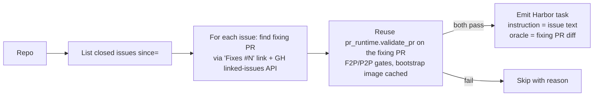

# RFC 0010: `issue_runtime`

**Status:** draft
**Author:** `@adithya-s-k`
**Created:** 2026-07-22
**Implemented by:** _(pending)_
**Reference dataset:** _(pending — target `AdithyaSK/repo2rlenv-issue-runtime`)_

## Summary

Mine a repo's issue tracker for **closed issues linked to a fixing PR**. Take the issue's title + body as the task instruction; take the fixing PR's tests as the F2P/P2P oracle. The agent gets the issue text, must produce a code change, gets graded against the maintainer's own test decision. **SWE-bench task shape, but generated on-demand from any repo instead of curated.**

## Motivation

SWE-bench (arXiv:2310.06770) established the standard eval setup for coding agents: real issue → fixing PR → run its tests. It's arguably the single most influential benchmark in the current agent research landscape. The catch: **the SWE-bench dataset itself is fixed at 2,294 tasks across 12 Python repos.** You can't extend it. You can't put your own repo through the same lens. You can't get 2026 issues (SWE-bench cuts off at 2023).

SWE-Gym (arXiv:2412.21139) improved things by opening up a broader mining pipeline — but it stopped at 2,438 tasks across 11 repos and hasn't been maintained. Neither ships as `repo2rlenv generate --repo <owner/name>`.

`issue_runtime` closes that loop:
- **Same task shape as SWE-bench** (issue text as instruction, PR tests as F2P/P2P). Direct comparability.
- **Any repo, any time-window.** Point it at `huggingface/transformers` and get 100 real issues from the last 6 months. Point it at your internal repo (via local source input) and turn your Jira into an RL env.
- **Reuses `pr_runtime`'s verifier verbatim.** Same F2P/P2P graded reward. Same anti-contamination guards.

### The pattern this pipeline breaks

`pr_runtime` today asks: "walk this repo's PRs, keep the ones where the diff produces a good task." That's *PR-centric* — the diff is the star and the issue (if any) is metadata. `issue_runtime` inverts: "walk this repo's issues, keep the ones with a fixing PR that produces a testable task." The **issue is the star**; the PR is the oracle.

Consequence: the emitted task's instruction is the *issue text* (a human bug report or feature request), NOT a curated leak-stripped summary. That's more realistic — the agent sees exactly what a maintainer sees — and it's cheaper to generate (no LLM-synthesized instruction). But it's also noisier: real issue text often includes stack traces, hostile tone, tangential discussion, or hints about the fix.

### The anti-argument

*"Isn't `pr_runtime` with a `require_linked_issue=True` option just this?"* Almost, but not quite:
- `pr_runtime`'s output uses the *PR title* or an LLM-synthesized instruction. `issue_runtime` uses the *issue text*.
- `pr_runtime`'s failure mode is "the diff didn't yield a good task"; `issue_runtime`'s failure mode is "the issue was resolved by a PR without any tests" — different filter set.
- The provenance chain is different: `issue → PR → commit` vs. `PR → issue (maybe)`.

Rolling this into `pr_runtime` is workable but muddies the mental model. `issue_runtime` is a sibling pipeline with a different input surface and different quality gates. When the shapes diverge cleanly, separate pipelines beat feature-flagged one-size-fits-all.

*"Isn't this what SWE-bench already ships?"* SWE-bench is a fixed dataset; `issue_runtime` is the pipeline that would let you *reproduce* SWE-bench and extend it. Complementary — SWE-bench is data, this is the generator.

## Design

### Input

- **Source** — GitHub · GitLab (both have issue APIs). Local doesn't apply — no issue tracker.
- **Trigger** — `repo2rlenv generate --pipeline issue_runtime --repo <owner/name> --pipeline-opt limit=100 --pipeline-opt since=2024-01-01 --llm anthropic/claude-sonnet-4-6 ...`.
- **Options model** — `IssueRuntimeOptions`:
  - `limit: int = 50` — max emitted tasks.
  - `since: str | None = None` — ISO date; only issues closed after this date.
  - `require_fixing_pr: bool = True` — issue must be linked to a merged PR (via "Fixes #N" / "Closes #N" in the PR body or GitHub's linked-issues API).
  - `min_issue_body_words: int = 30` — reject issues without meaningful text (bots / one-liners).
  - `max_issue_body_words: int = 2000` — cap on instruction length.
  - `require_fail_to_pass: bool = True` — reuse `pr_runtime` gate: the fixing PR must add or change tests that go RED → GREEN when the fix is applied.
  - `require_pass_to_pass: bool = True` — must have at least one P2P test the fix keeps green.
  - `strip_maintainer_hints: bool = False` — if True, apply the `commit_runtime` leak-strip prompt to the issue text before emitting (removes "the fix is probably in..." style comments).
  - `include_bot_issues: bool = False` — reject Dependabot / renovate-style issues by default.
  - `label_include: list[str] | None = None` — e.g. `["bug"]` restrict to bug-tagged issues.
  - `label_exclude: list[str] = ["duplicate", "wontfix", "invalid"]` — always drop.

### Algorithm

1. **List closed issues** in `[since, now)` via the source's API. Filter by labels.
2. **Find the fixing PR** for each issue:
   - Primary: parse issue's timeline events for `closed_by_pull_request` linking events.
   - Secondary: search merged PRs whose body matches `(Fixes|Closes|Resolves|Fix) #<n>` for this issue number.
   - If neither yields a merged PR, skip (with reason `no_fixing_pr`).
3. **Reuse `pr_runtime`'s existing validation harness** — same F2P/P2P gates. If the PR would be accepted by `pr_runtime`, it's accepted here.
4. **Skip if the fixing PR touches only docs / non-source paths** — matches `pr_runtime.lite_filter`.
5. **Emit Harbor task**:
   - `instruction.md` = issue title + issue body (optionally strip-processed).
   - `solution/patch.diff` = fixing PR's source-only diff.
   - `tests/verifier.py` + `tests/f2p.json` + `tests/p2p.json` = same as `pr_runtime`.

### Output

- **Task shape** — **identical** to `pr_runtime`'s. That's the whole point: any tooling that consumes `pr_runtime` tasks consumes these too. Only differences:
  - `[metadata.repo2env].pipeline = "issue_runtime"`.
  - `[metadata.repo2env].issue_runtime = { issue_number, issue_url, fixing_pr_number, fixing_pr_url, issue_labels, issue_reporter }`.
  - `instruction.md` sourcing (issue text, not PR-title / LLM-synth).

## Verification

- **Reward kind(s)** — `test_execution` + `graded`. Reuses `_pr_runtime_verifier.py` verbatim.
- **Reward formula** — same as `pr_runtime`: `reward = f2p_rate * p2p_rate`, `resolved = all F2P pass AND all P2P pass`.
- **Oracle invariant** — the fixing PR's diff, applied on top of `base_commit`, MUST score 1.0. Reuses `pr_runtime`'s emit-time gate.
- **Non-tamper** — inherited from `pr_runtime` — verifier baked in `tests/`, tests re-applied at grading time.

## Anti-contamination

- **How does the fix leak in?** Two big surfaces:
  1. **The issue text itself** — commenters and the reporter often include tracebacks, suspected root-cause modules, or literal fix suggestions. This is unavoidable and (arguably) legitimate — the whole point is to feed the agent what a maintainer sees.
  2. **The fixing PR is publicly visible** — an agent with unrestricted GitHub access can search `repo:owner/name is:pr is:merged "Fixes #N"` and find the exact patch.
- **Guards:**
  - Inherit `_env_guard.py`'s **git-history scrub** and **egress guard** wholesale from `pr_runtime` — blocks `git log`, blocks `pip install pkg==<fix-version>`, blocks fetching from github.com.
  - **`strip_maintainer_hints` option** — LLM pass over the issue text that removes "the fix is probably in `foo/bar.py`" style comments. Off by default (SWE-bench doesn't do this); user opt-in for cleaner eval.
  - **Never mention** the fixing PR number in the emitted `instruction.md`. Provenance stays in `[metadata.repo2env]` for reproducibility but agents don't see it.
- **The principle**: same as `pr_runtime` — environment blocks the outbound network paths to the fix; instruction is what the agent would legitimately see in a bug-triage session.

## LLM use

- **`at bootstrap` (cached)** — one per repo, reused across all issues in that repo.
- **`at synthesis`** — **zero** by default (instruction is the raw issue text). If `strip_maintainer_hints=True`, one LLM call per emitted task (~$0.02).
- **`at verify`** — no LLM.

For a 100-env dataset with `strip_maintainer_hints=False`: ~$0 in synthesis cost (bootstrap-amortized only). With hints stripped: ~$2 total.

## Yield & repo suitability

- **Expected yield** — 15-30% of "closed issues in window" survive after all gates. Most closed issues either lack a fixing PR (wontfix, duplicate, resolved out-of-band), lack a testable diff (docs, config, packaging), or their fixing PR doesn't produce clean F2P/P2P (mixed docs + code, or the tests were added-but-fail on `base^`).
- **What repos work?**
  - Repos with **linked issue-PR discipline** (maintainers actually use "Fixes #N"). All big pallets/psf/huggingface/pypa repos qualify.
  - Repos with **tests that touch behavior** (F2P/P2P is meaningful).
  - Repos with **any modern issue tracker activity** — >=50 closed issues per year, roughly.
- **What repos don't work?**
  - Repos without issue trackers (only forks or mirrors).
  - Repos where issues are tracked externally (Jira, mailing lists) — link discovery fails.
  - Repos whose fixing PRs are usually "add one line in a config" (tests aren't the oracle).

## Dependencies

- **Reused pipeline machinery** — `pr_runtime.validate_pr` (the whole F2P/P2P discovery gate), `_pr_runtime_verifier.py`, `_env_guard.py`, `bootstrap/`, `github.py` / `gitlab.py` (for the issue-listing REST calls; extended with issue-listing helpers).
- **New external deps** — none. Everything is stdlib + existing internals.

## Alternatives considered

- **Roll into `pr_runtime` via `--pipeline-opt input_source=issues`.** Rejected — muddies the option model (many `pr_runtime` options don't apply). Sibling pipeline > mega-option-flag pipeline.
- **Use LLM to auto-generate a synthetic instruction from the fixing PR (like `commit_runtime` does).** Rejected — the whole selling point vs. `pr_runtime` is "instruction = what a real human wrote." Also more expensive.
- **Require linked issues in `pr_runtime` to eliminate the pipeline.** Doesn't quite work — the naming would still be misleading (`pr_runtime` implies PR-input), and the fail modes (`no_fixing_pr` etc.) don't map cleanly onto `pr_runtime`'s existing skip-reason vocabulary.

## Rollout plan

1. **Smoke** — 5 issues from `huggingface/transformers` and 5 from `pallets/flask`, both bootstrap-cached. Read each emitted task; are the instructions coherent? Are the fixing PRs actually testable?
2. **Scale** — 100 tasks across ~10 repos. Include at least 3 repos SWE-bench doesn't cover (e.g. `huggingface/*` — direct value-add).
3. **Oracle gate** — every emitted task's fixing-PR diff must score 1.0. Reuses `pr_runtime`'s existing oracle-runner.
4. **Real-agent eval** — stratified sample n=10 with claude-code + Sonnet. Report solve rate against SWE-bench-equivalent baseline (~50-70% on modern models).
5. **Direct SWE-bench overlap check** — if we generate on `astropy`/`django`/`flask`/... at `<2023-06-01>`, we can spot-check the emitted tasks against SWE-bench's actual entries. If our generator produces the same PR set for the same date window, we've validated the pipeline against a ground truth.
6. **Publish** — `AdithyaSK/repo2rlenv-issue-runtime`, add to collection.
7. **Docs** — `docs/pipelines/issue_runtime.md`, findings.
8. **Ship `experimental` → `stable`**. Given how much machinery this reuses from `pr_runtime`, promotion to stable can be aggressive (2 releases with real usage).

## Open questions

- **Issue-body preprocessing.** SWE-bench feeds the raw issue body verbatim. Should we strip GitHub-specific markup (checkboxes, HTML details/summary)? Probably yes, minimal cleanup.
- **How to handle issues with multiple fixing PRs.** Sometimes a fix takes several PRs. Pick the one whose diff produces the F2P/P2P task; if multiple qualify, take the earliest merged.
- **P2P discovery from the linked PR, or across the whole suite?** SWE-bench does the latter. Mirror that.
- **Multi-lang.** The verifier is language-agnostic (via runner detection); the issue-body strip is not. Ship Python-first; add polyglot to the roadmap.
- **Whether to expose the issue's *comment thread* to the agent.** Comments often contain the fix suggestion. Default is NO (title + body only); opt-in for research use.

## References

- SWE-bench: [arXiv:2310.06770](https://arxiv.org/abs/2310.06770), [princeton-nlp/SWE-bench](https://github.com/SWE-bench/SWE-bench) — task shape reference.
- SWE-Gym: [arXiv:2412.21139](https://arxiv.org/abs/2412.21139), [SWE-Gym/SWE-Gym](https://github.com/SWE-Gym/SWE-Gym) — the closest prior pipeline, no `generate` interface.
- SWE-bench-Live: [SWE-bench/SWE-bench-Live](https://github.com/SWE-bench/SWE-bench-Live) — periodically-refreshed variant; complementary reference for "keep issue-based benchmarks current".
- In-repo prior art: `src/repo2rlenv/pipelines/pr_runtime.py` (reused validation harness), `src/repo2rlenv/pipelines/_pr_runtime_verifier.py` (verifier reused verbatim), `src/repo2rlenv/pipelines/_env_guard.py` (anti-contam), `src/repo2rlenv/github.py` (extended with issue-listing helpers).

## Implementation

*Filled in when the RFC status flips to `implemented`.*

| | |
|---|---|
| **Initial PR** | _(pending)_ |
| **Shipping release** | _(pending — target v0.9.x)_ |
| **Source file** | [`src/repo2rlenv/pipelines/issue_runtime.py`](https://github.com/huggingface/Repo2RLEnv/blob/mahttps://github.com/huggingface/Repo2RLEnv/blob/main/src/repo2rlenv/pipelines/issue_runtime.py) *(pending)* |
| **Options model** | [`src/repo2rlenv/spec/options.py`](https://github.com/huggingface/Repo2RLEnv/blob/mahttps://github.com/huggingface/Repo2RLEnv/blob/main/src/repo2rlenv/spec/options.py) — `IssueRuntimeOptions` *(pending)* |
| **Doc page** | [`docs/pipelines/issue_runtime.md`](../pipelines/issue_runtime.md) *(pending)* |
| **Findings / release notes** | _(pending)_ |
| **Reference dataset** | [`AdithyaSK/repo2rlenv-issue-runtime`](https://huggingface.co/datasets/AdithyaSK/repo2rlenv-issue-runtime) *(pending)* |
| **Follow-up PRs** | _(pending)_ |
