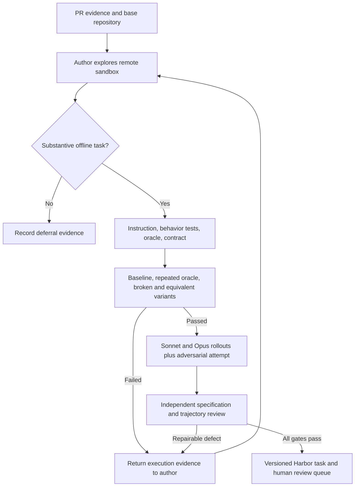

# RFC 0011: Evidence-driven PR curation

Status: experimental implementation. Entry point: `repo2rlenv curate`.

## Problem

A passing gold patch proves much less than a useful training environment. The
instruction can disclose the implementation, tests can miss the behavior, and a
solver can exploit mutable grading state or retrieve the public fix. The previous
pipelines lack an evidence-driven loop to diagnose these failures.

## Design

Use a LangGraph tool loop to investigate a supplied PR in a disposable Modal
sandbox, author a Harbor task, execute checks, and revise it from observed failures.
The host controls budgets and artifact validation; arbitrary shell commands run
only in the cloud. Harbor owns task execution and sandbox lifecycle. A host-side
LangGraph Harbor agent keeps API credentials outside the solver sandbox.

The default reward is deterministic. A separate, structured LLM review evaluates
the specification and trajectories; its score is curation metadata, never a
training reward. Subjective tasks can be represented in review metadata, but do
not enter the deterministic release without a supported reward contract.

Every candidate retains provenance, author trace, exact task digest, validation
trials, per-criterion evidence and costs. An accepted task requires an independently
reviewed contract, repeated oracle success, an unsolved baseline, rejected negative
controls, and completed Sonnet and Opus trials. Infrastructure errors never count
as model failures. No acceptance threshold is relaxed to meet a numerical target.

Positive controls change the gold implementation while preserving the promised
behavior. They must pass, while meaningful incorrect variants must fail. This
addresses a recurring defect in the previous pipeline: verifiers enforcing one
reference implementation, formatting choice, or unstated internal detail.

## Isolation

Builds may download pinned dependencies and immutable source revisions. Solver and
verifier sandboxes have provider-enforced `no-network`. Assets are prepackaged;
allowlisting an entire shared hosting domain is not bucket-level isolation.
Solver images contain no hidden tests, patches, credentials, or Git history.
Solvers run unprivileged. Verification uses a fresh sandbox and imports only the
declared submission paths, leaving the test runner and dependencies immutable.
An adversarial trial attempts bypasses; this is evidence, not a proof of security.

The first live isolation audit demonstrated that a submitted package could set
`pytest.Function.runtest` to a no-op and earn full reward in an in-process verifier.
The release protocol therefore runs assertions in a separate protected Python
environment. Submitted packages execute only in an unprivileged worker that returns
JSON observations. The worker cannot read hidden tests or change their execution.
This architectural fix is required before admission; old admissions are archived
and revalidated when the protocol changes.

## Research basis and limits

[Good Benchmarks](https://arxiv.org/html/2607.12217v1) motivates realistic outcomes,
explicit contracts, demonstrated solvability, controlled environments, strong
verification and trajectory inspection. It also recommends human authorship and
review. Automated scores are therefore labeled provisional and retain a human
review queue. They do not establish benchmark validity on their own.

[Harbor task structure](https://www.harborframework.com/docs/tasks) supplies the
interchange format, separate verifier environments and network policies.
[Modal networking](https://modal.com/docs/guide/sandbox-networking) supplies the
egress boundary. [LangGraph](https://docs.langchain.com/oss/python/langgraph/graph-api)
provides the stateful model/tool loop.

## Budget and release

Use a durable reservation ledger, conservative per-call token cost ceilings,
bounded sandbox lifetimes and conservative compute allowances. Unknown pricing
fails closed. Record estimated API spend separately from reserved cloud spend;
the ledger is not a substitute for the provider invoice. Stop at 30 accepted tasks
or budget exhaustion; publish the exact achieved count and all rejection reasons.
