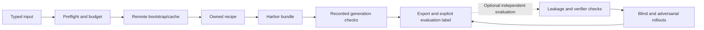

# RFC 0011: repository-owned generation recipes

**Status:** experimental implementation in [PR #109](https://github.com/huggingface/Repo2RLEnv/pull/109); campaign evidence is published separately
**Author:** @adithya-s-k
**Created:** 2026-09-11

## Summary

Integrate fourteen research-inspired generation methods as repository-owned recipes
behind the existing pipeline interface. Share remote bootstrap, Harbor emission,
quality evaluation, spending controls and the Rich CLI; preserve each method's
algorithm, provenance and separate results.

## Motivation

The upstream experiments produced 28 distinct exports, 21 execution-contrast
passes including two repairs, and no completed training approvals. Running those
experiments requires installing upstream research projects. Owned recipes remove
that dependency while retaining evidence to compare behavior. The alternative of
only maintaining upstream wrappers does not meet the ownership requirement.

## Design

### Input

Extend `GenerationInput` with a discriminated source: repository, explicit PR,
seed records, existing Harbor task, terminal recording or reasoning family.
Legacy `repo` configurations normalize to a repository source. Reject conflicting
inputs. `PipelineSpec.recipe` defaults to `native` to preserve existing behavior.
An explicit PR uses `pr_to_env` (RFC 0007); mining remains `pr_runtime`.

Recipe descriptions declare source kinds, supported languages, required model
roles, stages, dependencies and implementation status. Discovery works without
credentials or cloud imports. Strict per-recipe options prevent silent typos.

### Algorithm

The remote execution adapter provides bounded commands, file transfer, build
readiness, reset and cleanup. Modal VM and Daytona DinD are supported routes when
their capability probes pass. Docker/task execution never silently falls back to
the caller's machine. Reuse bootstrap inside the worker before generalizing its
execution primitives. Keep Git `provider.py` separate from cloud execution.

Use dependency image keys plus exact snapshot identities; include toolchain,
lockfiles, build inputs and resource/platform settings. Validate fresh snapshots
and do not put private answer artifacts into shared learner images.

Each operation has a stable identity and persisted state. Reserve spend before
dispatch. An uncertain call remains reserved until reconciliation; never retry a
potentially paid operation just because a controller crashed. Record existing
LLM cost/usage records once, with separate infrastructure settlements.

### Output

General Harbor bundles contain arbitrary reference scripts and binary assets,
not just patch oracles. Preserve the legacy `HarborTask` adapter. Validate paths,
file roles and executable modes, and hash the complete emitted contract excluding
its own hash field. Keep resolved dependency/image/asset digests in that identity.
Write bundles atomically; refuse collisions and unsafe path traversal.

Separate emitted, execution-verified and accepted counts. Quality reports contain
criterion outcomes, evidence, uncertainty, task identity and exact reviewer/solver
configuration. Reports and traces stay outside learner-visible artifacts.

## Verification

Generation checks are recipe-specific: source/test contrast, terminal baseline and
reference trials, or deterministic instance checks. A successful export has a
complete Harbor contract and its recorded generation evidence. It does not claim
independent semantic quality or blind-solver success.

The [review and repair loop](0027-harbor-quality-loop.md) can independently assess
instruction, verifier and leakage, run behavioral probes and review solver traces.
Repairs create new identities and invalidate affected evidence. Uniform labels
preserve unverified exports and known issues for later diagnosis.

The [dataset index](../pipelines/releases.md) records current outputs;
[RFC 0030](0030-campaign-expansion-and-release.md) defines selection and publication.
SEC-bench remains deferred and is not an implemented recipe.

## Anti-contamination

Scrub future Git objects and private files from learner snapshots and image layers.
Prefetch exact required assets, then probe learner egress restrictions. Broad HF
host access is not bucket-only access. Keep model/provider credentials and the
Docker socket outside learner control. Execute private reference grading outside
processes controlled by learner code. Reuse `_env_guard` where applicable, but its
existing hostname denylist is insufficient to establish offline isolation.

## LLM use

Reuse `llm.py` for metered author/reviewer calls and configurable agent clients for
tool-using workflows. Generation and review may use LLMs; deterministic verifiers
remain the default reward. Native baseline and changed prompts/models are recorded
as different recipe revisions. LangGraph is an optional orchestration library,
not a replacement for all the method-specific algorithms.

## Yield and suitability

Use supported input profiles and report distinct attempted candidates, new exports
and independent acceptance separately. [Economics](../pipelines/economics.md)
defines the sample denominators and cost scopes. Missing measurements remain
unavailable. SCALER's programmatic generation has zero model cost but still uses
compute; Tasksmith's assisted evaluation cost is not a generation-only benchmark.

## Dependencies

Owned code lives under `pipelines/recipes/`, `execution/`, `quality/`, `campaigns/`
and existing spec/bootstrap/emitter/UI modules. Essential SDKs and ordinary
libraries may be optional extras. No runtime import/install/clone of upstream
research projects, no reliance on ignored references or reproduction artifacts.
Target repository cloning is an input operation and remains supported.

Bootstrap, tracing and quality are shared components rather than additional task
counts. Each supported recipe's source map and implementation limits are recorded
in its own guide and provenance file.

## Alternatives considered

One upstream install per recipe violates ownership. One generic generator loses
the methodological distinctions. A new CLI framework duplicates existing Rich
and argparse infrastructure. Tasksmith uses the shared execution, bootstrap and quality stages through its
agent-driven construction route.

## References

- [Original reproduction PR](https://github.com/huggingface/Repo2RLEnv/pull/101)
- [Harbor tasks](https://www.harborframework.com/docs/tasks)
- [Modal VM sandboxes](https://modal.com/docs/guide/vm-sandboxes)
- [Daytona snapshots](https://www.daytona.io/docs/snapshots/)
- [Daytona firewall](https://www.daytona.io/docs/en/network-limits/)
- Individual pinned source paths and licenses are recorded in RFCs 0012–0026.

## Implementation

Fourteen research recipes and Tasksmith are implemented. The [guides](../pipelines/README.md)
describe their supported profiles. Generation exports, published artifacts and
independent quality acceptance remain distinct.
