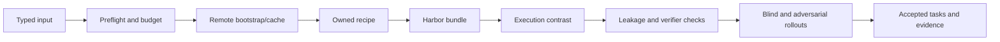

# RFC 0011: repository-owned generation recipes

**Status:** accepted design; implementation in progress
**Author:** @adithya-s-k
**Created:** 2026-09-11

## Summary

Integrate fifteen research-inspired generation methods as repository-owned recipes
behind the existing pipeline interface. Share remote bootstrap, Harbor emission,
quality evaluation, spending controls and the Rich CLI; preserve each method's
algorithm, provenance and separate results.

The user approved a single integration PR on September 11. RFC commits precede
implementation commits in this PR. The upstream reproduction draft PR #101 stays
unchanged. This overrides the usual separate RFC-PR process for this integration.

## Motivation

The upstream experiments produced 28 distinct exports, 21 execution-contrast
passes including two repairs, and no completed training approvals. Running those
experiments requires installing upstream research projects. Owned recipes remove
that dependency while retaining evidence to compare behavior. The alternative of
only maintaining upstream wrappers does not meet the ownership requirement.

## Design

### Input

Extend `GenerationInput` with a discriminated source: repository, explicit PR,
seed records, existing Harbor task, terminal recording or reasoning family.
Legacy `repo` configurations normalize to a repository source. Reject conflicting
inputs. `PipelineSpec.recipe` defaults to `native` to preserve existing behavior.
An explicit PR uses `pr_to_env` (RFC 0007); mining remains `pr_runtime`.

Recipe descriptions declare source kinds, supported languages, required model
roles, stages, dependencies and implementation status. Discovery works without
credentials or cloud imports. Strict per-recipe options prevent silent typos.

### Algorithm

The remote execution adapter provides bounded commands, file transfer, build
readiness, reset and cleanup. Modal VM and Daytona DinD are supported routes when
their capability probes pass. Docker/task execution never silently falls back to
the caller's machine. Reuse bootstrap inside the worker before generalizing its
execution primitives. Keep Git `provider.py` separate from cloud execution.

Use dependency image keys plus exact snapshot identities; include toolchain,
lockfiles, build inputs and resource/platform settings. Validate fresh snapshots
and do not put private answer artifacts into shared learner images.

Each operation has a stable identity and persisted state. Reserve spend before
dispatch. An uncertain call remains reserved until reconciliation; never retry a
potentially paid operation just because a controller crashed. Record existing
LLM cost/usage records once, with separate infrastructure settlements.

### Output

General Harbor bundles contain arbitrary reference scripts and binary assets,
not just patch oracles. Preserve the legacy `HarborTask` adapter. Validate paths,
file roles and executable modes, and hash the complete emitted contract excluding
its own hash field. Keep resolved dependency/image/asset digests in that identity.
Write bundles atomically; refuse collisions and unsafe path traversal.

Separate emitted, execution-verified and accepted counts. Quality reports contain
criterion outcomes, evidence, uncertainty, task identity and exact reviewer/solver
configuration. Reports and traces stay outside learner-visible artifacts.

## Verification

Hard acceptance gates require a fresh build, intended baseline failure, two clean
oracle successes, expected nonempty test identities, required regression success,
isolation and shortcut/partial-solution checks. Preserve each reward scale;
an empty test report or infrastructure error never yields success. Independent
Sonnet and Opus rollouts measure difficulty and expose task/verifier defects.
Do not require every solver to succeed. Unknown criteria are not passes.

Test source/config compatibility, recipe registries, package assets, CLI/Rich/plain
output, interruption/resume, reservation reconciliation, verifier integrity and
provider cleanup. Run the existing pipeline contract tests, full CI matrix,
wheel/sdist install checks, docs checks and remote Harbor trials.

## Anti-contamination

Scrub future Git objects and private files from learner snapshots and image layers.
Prefetch exact required assets, then probe learner egress restrictions. Broad HF
host access is not bucket-only access. Keep model/provider credentials and the
Docker socket outside learner control. Execute private reference grading outside
processes controlled by learner code. Reuse `_env_guard` where applicable, but its
existing hostname denylist is insufficient to establish offline isolation.

## LLM use

Reuse `llm.py` for metered author/reviewer calls and configurable agent clients for
tool-using workflows. Generation and review may use LLMs; deterministic verifiers
remain the default reward. Native baseline and changed prompts/models are recorded
as different recipe revisions. LangGraph is an optional orchestration library,
not a replacement for all the method-specific algorithms.

## Yield and suitability

Implement sequentially in RFC order 0012–0026. Start 1 → 5 → 20 accepted tasks per
recipe. SWE-smith and released-family SCALER are provisional 100-task candidates;
SWE-Flow and R2E may expand after measurement. All others start with 20. SCALER is
a reasoning track, not repository coding or new-family synthesis.

The recorded campaign balance is $477.57 of the existing $500 allowance; it must
be reconciled before new dispatch. Prefer covering the first 20 of every method
before expansions. Expansion requires observed all-in cost ≤ $0.50 per accepted
task, median warm service time ≤ 10 minutes, and the incremental 80-task forecast
plus 25% contingency fitting after outstanding first-pass reservations. These
are policy defaults, not established performance. Budget exhaustion preserves
evidence and reports the shortfall; it never lowers quality standards.

## Dependencies

Owned code lives under `pipelines/recipes/`, `execution/`, `quality/`, `campaigns/`
and existing spec/bootstrap/emitter/UI modules. Essential SDKs and ordinary
libraries may be optional extras. No runtime import/install/clone of upstream
research projects, no reliance on ignored references or reproduction artifacts.
Target repository cloning is an input operation and remains supported.

Supporting methods become owned stages: RepoLaunch (bootstrap), SWE-Flow-Trace
(tracing), SWE-bench-Live (collection), released SWE-rebench V2 components
(annotation/build/evaluation), SWE-Dev (test synthesis), SWE-Mutation (probes),
harden-v0 (adversarial repair) and SecVerifier (security validation). Measure them
on 20 suitable existing cases initially; they do not inflate new-task counts.

## Alternatives considered

One upstream install per recipe violates ownership. One generic generator loses
the methodological distinctions. A new CLI framework duplicates existing Rich
and argparse infrastructure. A full Tasksmith rewrite is unnecessary for these
ports; Tasksmith may consume the shared owned stages later.

## Rollout plan

Ship discoverable recipe metadata, typed input, common events/budget, general
emission and remote execution first. Register recipes as executable only after
their implementation and smoke checks exist. For each, supply strict options,
an RFC, guide, sample config, exact source attribution and packaged license/prompt
assets, then the measured campaign. Keep one new integration PR with sequential
commits and an evidence checklist. No release/version bump or merge is implicit.

## Open questions

Daytona network policy is account-tier dependent; Modal VM currently lacks GPUs.
Probe capabilities and pin SDK/Harbor contracts before advertising support. Three
upstream generators and several supporting components remain blocked or source-only;
registration is not completion. Population-wide quality and full campaign cost
remain empirical questions.

## References

- [Original reproduction PR](https://github.com/huggingface/Repo2RLEnv/pull/101)
- [Harbor tasks](https://www.harborframework.com/docs/tasks)
- [Modal VM sandboxes](https://modal.com/docs/guide/vm-sandboxes)
- [Daytona snapshots](https://www.daytona.io/docs/snapshots/)
- [Daytona firewall](https://www.daytona.io/docs/en/network-limits/)
- Individual pinned source paths and licenses are recorded in RFCs 0012–0026.

## Implementation

In progress. Completion requires owned working recipes and independently audited
artifacts, not merely a public command or emitted directory.
