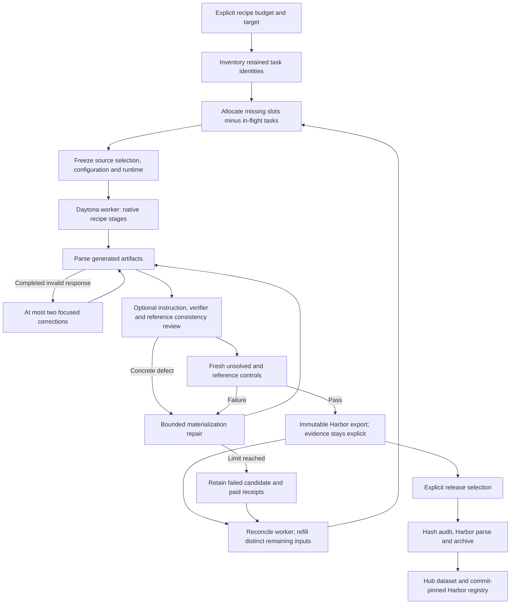

# RFC 0029: Bounded expansion and immutable Harbor releases

Status: implemented; generation and publication evidence are recorded per release.

## Problem and outcome

A successful five-task pilot does not fill a dataset. A baseline/reference pair also
does not prove that the verifier checks the requested deliverable. Expansion must
keep producing distinct tasks, retain failed attempts and costs, and publish the
actual evidence without relabeling every export as independently accepted.

The owned recipes keep their original source and generation stages. Shared code
adds completed-response correction, a compact draft consistency check, parallel
allocation and an explicit release boundary. Pipeline-specific RFCs 0012–0026
record upstream credit and the differences from the research implementations.

## Generation contract

A reusable script must be exercised by its verifier. Creating a saved answer or
matching source keywords does not establish program behavior. The reference must
fix the requested deliverable, not merely produce one expected output. The compact
review requests exact citations and only blocks concrete defects; task difficulty,
minor polish and missing optional edge cases do not block generation. The reviewer
never supplies an episode reward. Its findings remain model judgments rather than
proof of semantic correctness.

`review_drafts` opts terminal recipes into this check. `exclude_seed_sha256` excludes
canonical seed identities before shuffling and candidate limits. Recording inputs
must be copied into fixed shards when their acquisition cache is still growing.
Repository reconstruction receives both scheduled functions and test decorators;
parametrized aliases must not become invented public APIs.

`validated_complete` corrects a completed response using the original input and
its precise schema/content error, with a new metered operation identity. Provider
errors propagate and keep their uncertain reservations. They are not interpreted
as an invalid response and blindly replayed. A task's materialization bound remains
one initial attempt plus two repairs by default.

## Concurrency and accounting

`available_task_slots` reserves outstanding batch targets against one serialized
inventory snapshot. A racing export cannot release a slot before the inventory
counts it. Repository diversity also has an explicit per-source cap. This is
separate from `BudgetLedger`, which reserves worker/model costs transactionally.

The six new recipe campaigns each have a $100 cap. Parent holds and child charges
represent the same funds and must not be summed. New batches use Daytona, with no
automatic provider fallback. Interrupted or ambiguous dispatches require receipt
reconciliation; controllers adopt confirmed live jobs instead of replaying them.
Worker lifetime charges are conservative estimates, including a separately noted
image-build allowance, not provider invoices.

## Publication contract

`repo2rlenv release stage` takes an explicit `ReleasePlan`, checks exact task bundle
hashes and Harbor parsing, and stages only the selected task directories. It never
uploads a campaign directory. `manifest.json` preserves per-task quality labels,
source provenance, supplied execution evidence, diagnostics and economic scope.
No inferred acceptance or solver success is added during publication.

`ReleasePlan.normalize_evaluation_labels` explicitly opts into annotating missing
historical evaluation blocks in the copied release. Such tasks become `unverified`
for independent quality acceptance, while retaining their generation labels.
Existing evaluation labels are preserved. Annotation-independent bundle identities
must still match the selected sources; physical configuration and archive hashes
are recorded anew. The original configuration hash and path remain in the label,
and no historical source directory or release is rewritten.

An executable-mode-preserving `tasks.tar.gz` accompanies browsable `tasks/`, a
JSONL index and per-file hashes. This matters because a Hub file download need not
preserve local executable bits, which are part of an owned bundle's identity.
The release is immutable locally; changed bytes or modes require a new staging
path. The selected source exports are never rewritten.

`release publish` uploads the snapshot, writes a Harbor registry pinned to its
upload commit and optionally adds the dataset to a collection. It records the
remote commit and publication state. A missing response leaves a receipt for
reconciliation; it does not trigger an automatic second upload. Publication uses
the Hub SDK, without local Docker builds or image-registry mutation.

Mixed source materials retain their original licenses and attribution. Dataset
cards describe the actual recipe, controls and limitations. Publication does not
apply a blanket software license to repository snapshots or attributed excerpts.

## Validation

Software tests cover correction limits, no retry after a provider timeout, fixture
binding preservation, quoted review evidence, racing parallel allocations, changed
release inputs, duplicate selection, archive modes, immutable staging, publication
receipts and commit-pinned registries. These checks complement the recorded remote
recipe controls; they do not replace independent semantic or solver evaluation.
