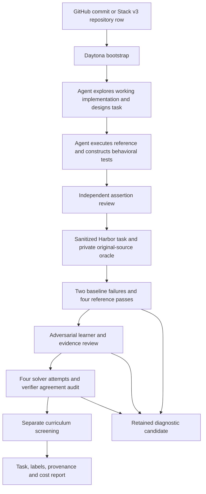

# RFC 0031: CodeMidas source-to-environment recipe

**Status:** implementation in [PR #165](https://github.com/huggingface/Repo2RLEnv/pull/165); 100 tasks staged locally, adversarial checks blocked

**Author:** adithya-s-k

**Created:** 2026-09-25

## Objective and scope

Add an owned `codemidas` recipe to `repo_reconstruct`, producing standard Harbor
tasks from implemented repository functionality. The first campaign targets 100
generated tasks on Daytona with a $300 total allowance and exclusively OpenAI
GPT-6 Sol/Luna calls. Generated, execution-verified, reviewed and curriculum-selected
counts are reported separately. No model-training result is claimed.

The recipe independently implements [CodeMidas](https://arxiv.org/abs/2609.22068).
No upstream research package is installed. The publication does not supply exact
construction prompts, model identities or the final screening attempt count;
our prompts, models, budgets and attempt counts are explicit reproducibility choices.

## Method and stage contracts

1. **Source:** freeze source revision, actual file hashes and provenance. Stack v3
   is another source adapter, not a different synthesis method. Dataset revision,
   repository row identity and original commit are retained. Missing build assets
   may be recovered only from that commit, with a separate materialization label.
2. **Bootstrap:** use dependency layers shared across candidates. Execute repository
   code only remotely. Require working public entry points, not existing upstream
   tests. Check the sanitized package before authoring: removing private tests can
   remove packages declared by the build. Empty package scaffolding may be restored,
   without restoring test content. A failed build is an infrastructure/source
   limitation, not a hard task.
3. **Design:** an agent inspects source and executes public interfaces, chooses a
   coherent feature, and writes a behavioral contract and explicit implementation
   boundaries. Preserve interfaces, surrounding dependencies and unrelated code.
   Render every requirement into the learner's instruction deterministically.
   Independent review checks this exact rendered contract, including contradictions
   between introductory prose and acceptance criteria.
4. **Tests:** record actual reference executions and map each private test to a
   public requirement. Do not infer incidental output ordering or implementation
   structure as requirements. Review assertions in an independent model context.
   Before freezing, a reviewer can route a correction to the verifier or to an
   inaccurate description of the public API. The selected feature remains fixed;
   all corrections share a maximum of three executed verifier versions.
5. **Export:** preserve the original implementation privately. The learner gets
   a sanitized source tree; the original target implementation, upstream target
   tests, construction files, history and build residue must not be available.
   Grade allowlisted submitted source in a separate clean verifier. Rewards are
   deterministic binary test outcomes, with no LLM used during grading.
6. **Consistency:** two fresh baseline trials must fail for task behavior, and four
   fresh oracle trials must pass. Missing tests, infrastructure errors and collection
   failures do not establish contrast. Receipts identify the exact task revision.
7. **Post-rollout checks:** retain commands, outputs, submitted source and verifier
   results. An independent reviewer evaluates exploit evidence and requirement/test
   disagreements. Four solution attempts are audited. Curriculum screening uses
   an additional configurable sample (default four); this number is our choice.
   A provider access block pauses adversarial dispatch across the campaign. Solver
   agreement and difficulty can still be measured, but full method soundness and
   curriculum acceptance remain unestablished. Preserve the blocked-stage label.
8. **Retention:** all-pass/all-fail is model-dependent curriculum evidence, not proof
   of a defective environment. Keep sound tasks with this label. Preserve rejected
   candidates and failure reasons outside the checked-in source tree.

## Runtime and models

Use the existing artifact-submission protocol, campaign ledger, remote worker,
Harbor exporter and CLI progress events. Add a small metered Responses API runtime
for controller-owned tools because the current Pi/OpenCode bridge is Anthropic-only.
Provider credentials remain on the controller; model tools run in isolated remote
containers. This runtime can subsequently serve Tasksmith without changing its
existing defaults.

Models are `openai/gpt-6-luna` for exploration/authoring and initial solution attempts,
and `openai/gpt-6-sol` for independent review and curriculum screening. No Anthropic
fallback is permitted in this campaign. Record exact model names and inference
settings per call. [Official model contracts](https://developers.openai.com/api/docs/models)
require Responses API for tool calling with reasoning enabled.

Each provider effect reserves spend before dispatch. Unknown outcomes retain their
reservation and are not silently retried. Local control, unit tests and source reads
are allowed; Docker builds and repository execution use Daytona exclusively.

## First supported profile

CPU Python libraries, CLI functions and class methods with finite offline fixtures.
Start with five repositories, then broaden the source panel. Multi-language exports,
GPU tasks and external-service integration are separate profiles, not implied by
the paper's language coverage. Target functions need neither docstrings nor existing
tests. Feature discovery should include related symbols where the scope warrants it.

Construction corrections are bounded (default three); final rollout-based filtering
does not rewrite requirements to make the screening model pass. Any optional later
repair produces a new revision and is reported separately from the reproduction.

## Source adapters

The first adapter accepts a public GitHub repository at a pinned commit. The second
accepts a bounded, pinned [Stack v3 training](https://huggingface.co/datasets/HuggingFaceCode/stack-v3-train)
repository row with inline files. Validate every path, reject duplicate/colliding paths
and oversized rows, preserve license information and honor upstream removals when
refreshing inputs. Dataset metadata does not replace file-level provenance.
Never download the entire corpus to locate a small panel. Missing files, filtered
contents and hydration from GitHub must be explicit in the resulting manifest.

## Output, evidence and economics

Standard `task.toml`, `instruction.md`, `environment/`, `solution/`, `tests/`.
Use shared evaluation labels and immutable bundle identities. Keep raw traces,
provider receipts, model requests, checkpoints, images and datasets in ignored
campaign directories. Commit source, prompts, RFC, tests and concise measured results.

Report candidates attempted, generated tasks, execution-verified tasks, reviewed
tasks and curriculum-selected tasks, plus reasons for each rejection. Report total
campaign spend divided by each denominator, including unsuccessful attempts and
compute. No cost-per-task estimate is asserted before the pilot. The $300 cap is an
authorization limit, not a promise that 100 fully screened tasks will fit.

## Verification and rollout

Contract tests cover OpenAI-only routing, metering and interrupted requests, source
path validation, implementation removal/oracle restoration, prompt/assertion mapping,
fresh execution controls, model-outcome classification, and identity-bound resumption.
Existing recipe behavior must remain unchanged. Run a small end-to-end Daytona
pilot, inspect tasks and evidence, then scale with bounded worker concurrency.
Finish with a reproducible local task collection and a draft PR; publication and
package releases are separate actions.

## Measured outcome

The first campaign completed a 100-task local collection. Every selected task passed
six execution controls and ordinary solver review, with four additional Sol screens.
Provider-blocked adversarial checks remain explicit; full method acceptance is not
claimed. [Measured yield, difficulty, sources and economics](../pipelines/codemidas.md#measured-local-campaign)
include rejected attempts and distinguish API usage from compute estimates. The PR is prepared for review; no dataset publication, merge or package release is included.

## Release boundary

The [release document](../release_notes/codemidas.md) records the audit, publication
packaging and post-merge steps. Optional `evidence_documents` attach explicit JSON
summaries outside executable task bundles; source receipts remain bound by hashes.
No automatic traversal of controller paths or raw model-request upload is allowed.
Inconclusive review labels remain blocked rather than asserting a demonstrated defect.

## Credit and implementation map

Credit Bowen Ye et al., Xiaomi MiMo and collaborating institutions, arXiv:2609.22068.
The code and prompts here are independently authored under this repository's license;
the paper's arXiv distribution license is not an upstream software license.

- New recipe: `src/repo2rlenv/pipelines/recipes/codemidas/`
- Models/options: `src/repo2rlenv/spec/recipe_options.py`
- Discovery: shared recipe catalog and generation CLI
- Runtime: `src/repo2rlenv/tasksmith/author/openai_agent.py`
- Shared export: `src/repo2rlenv/pipelines/recipes/repository/export.py`
- Documentation: `docs/pipelines/codemidas.md`
