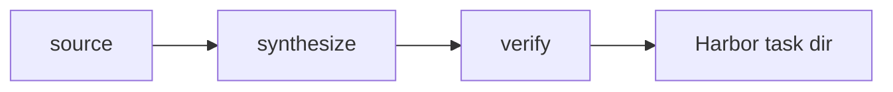

# RFC NNNN: `<pipeline_name>`

**Status:** draft
**Author:** `<your GH handle>`
**Created:** YYYY-MM-DD

Once the RFC reaches `status: implemented`, fill in the [Implementation](#implementation) section at the bottom with pointers to the PR, source file, doc page, findings, and reference dataset.

## Summary

One paragraph. What the pipeline does and why anyone should care. If you can't compress it to two sentences, the design isn't crisp enough yet.

## Motivation

Why does this pipeline need to exist as a separate thing? What gap does it fill vs. the existing set? If there's a related paper / dataset / repo, cite it (link to `references/<name>/` if you've cloned it).

Include the anti-argument too: what's the case for *not* building this / rolling it into an existing pipeline? Write the counter and explain why the RFC still stands.

## Design

### Input

- **Source** — GitHub / GitLab / local / one of the above via an existing input-source abstraction.
- **Trigger** — how the user invokes it: `repo2rlenv generate --pipeline <name> ...`. List the required + optional `--pipeline-opt` fields.
- **Options model** — fields the pipeline reads from `<Name>Options`. What's mandatory, what has defaults, what's a mistake to expose.

### Algorithm

Ordered numbered steps. Enough detail that someone else could implement without reading external context. A mermaid diagram if it helps.

### Output

- **Task shape** — what files ship in the emitted task dir (Dockerfile, test.sh, verifier.py, f2p.json, p2p.json, patch.diff, instruction.md, task.toml). Reuse the existing shape unless there's a good reason to differ.
- **`[metadata.repo2env]` provenance** — what pipeline-specific fields the toml carries beyond the shared ones (`pipeline`, `repo`, `ref`, `reward_kinds`, `reward_calibration`).

## Verification

- **Reward kind(s)** — `test_execution` / `diff_similarity` / both.
- **Reward formula** — the exact function. If it's graded F2P/P2P, say so; if it's binary, say why binary is defensible.
- **Oracle invariant** — the gold patch must score exactly `1.0` (or `resolved=True`). Explicitly state this.
- **Non-tamper** — how the emitted `test.sh` prevents an agent from passing by editing the tests. Should reuse the existing `_pr_runtime_verifier` git-reset-and-reapply pattern unless there's a strong reason.

## Anti-contamination

- **How does the fix leak in?** Enumerate the observed / plausible leak paths for *this* pipeline's task shape. Ex: PyPI has the fixed version, GitHub has the fix PR, the commit message names the function, the instruction quotes the CVE ID.
- **Guards** — which of `_env_guard.py`'s existing defenses apply out of the box (git-history scrub, egress guard). What's pipeline-specific (leak-strip patterns, instruction sourcing).
- **The principle**: the environment enforces, the prompt never asks. If your design depends on the *prompt* not telling the agent something, that's a bug in the design.

## LLM use

Where the model is invoked. One of:

- **`at bootstrap` (cached)** — one-time env construction per (repo, ref). Doesn't add per-task cost.
- **`at synthesis`** — the pipeline itself calls the LLM per emitted task. Track budget.
- **`at verify`** — the LLM is called at reward computation time. Rare (only `pr_diff`'s LLM-judge). Requires the verifier to degrade gracefully when the API key is absent.

Include a cost order-of-magnitude estimate for a 100-env dataset: N × K token calls × $ per call = ~$X.

## Yield & repo suitability

- **Expected yield** — `emitted ÷ candidates_examined`. Cite similar pipelines for anchoring.
- **What repos work?** — pytest-clean, CPU-only, library-shaped. Any pipeline-specific extras (needs a working CI history, needs public issue trackers, …).
- **What repos don't work?** — Be honest about limits. See `commit_runtime`'s "PR-driven repos yield ~0" note as the model.

## Dependencies

- **Reused pipeline machinery** — validation harness (`pr_runtime.validate_pr`), eval-script builder, `_env_guard`, verifier module. List what's imported vs. what's new.
- **New external deps** — anything that lands in `pyproject.toml`. Prefer stdlib.

## Alternatives considered

Two or three design choices you made and the shapes you rejected. Not exhaustive; just the non-obvious ones.

## Rollout plan

The lifecycle any new pipeline goes through, adapted to yours:

1. **Smoke** — a handful of tasks on 2–3 cached-bootstrap repos; manually inspect emitted content.
2. **Scale** — target 100 tasks across 6–10 repos (or whatever the pipeline's yield realistically supports).
3. **Oracle gate** — `harbor run -a oracle --env docker`; every task should score exactly 1.0. Drop the ones that don't.
4. **Real-agent eval** — stratified sample with claude-code + Sonnet at `n=2` (Arc 2's OOM lesson).
5. **Publish** — HF Hub dataset with enriched manifest.
6. **Docs** — `docs/pipelines/<name>.md` + `docs/release_notes/vX.Y/findings-<name>.md`.
7. **Ship experimental** — flag `experimental = True`. Real-world use for a release cycle.
8. **Promote to stable** if quality + audit hold up. Flip the flag, update the pipeline-table stability column.

## Open questions

- Bulleted list of things you don't know yet and need review input on.

## References

- Paper / prior art you're drawing from, with arxiv IDs or DOIs.
- Similar pipelines in-repo (link `src/repo2rlenv/pipelines/<sibling>.py`).
- Any external repos cloned to `references/<name>/`.

## Implementation

*Filled in when the RFC status flips to `implemented`. Delete or leave as a placeholder while `draft` / `review` / `accepted`.*

| | |
|---|---|
| **Initial PR** | (link) |
| **Shipping release** | v?.?.? |
| **Source file** | [`src/repo2rlenv/pipelines/<name>.py`](../../src/repo2rlenv/pipelines/<name>.py) |
| **Options model** | [`src/repo2rlenv/spec/options.py`](../../src/repo2rlenv/spec/options.py) — `<Name>Options` |
| **Doc page** | [`docs/pipelines/<name>.md`](../pipelines/<name>.md) |
| **Findings / release notes** | [`docs/release_notes/v?.?.?/findings-<name>.md`](../release_notes/) *(if published)* |
| **Reference dataset** | [`AdithyaSK/repo2rlenv-<name>`](https://huggingface.co/datasets/AdithyaSK/repo2rlenv-<name>) *(if published)* |
| **Follow-up PRs** | List post-initial merges that materially changed the pipeline — `#66` LLM synthesis, `#69` hardening, etc. Keep concise; the git log is the source of truth. |

Any material changes to the pipeline *after* it ships (design pivots, new options, breaking-change PRs) get appended here or in a new "Change history" subsection. Small polish PRs don't need to be listed.
